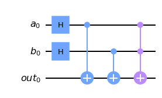

# LOGICAL GATE STANDARDS
   QALU has all classical logic gates(i.e and, or, xor, xnor). Gates are named as **name of gate+\_**  just like **and_**() instead of **and()** in order to prevent confliction. Otherwise, python core interpreter would interpreter it as quantum logic gate instead of classical and logical operation
***
## and_(circ,a,b,out)

   And gate is used to perform "and operation". If both inputs are true, then it returns true. If at least one of them is false, it returns false
   It has 4 arguments:
   * **circ** is quantum circuit that you will add the gate.
   * **A** is one of the qubits that it will be processed. It's an integer.
   * **B** is one of the qubits that it will be processed. It's an integer.
   * **C** is the qubit that it represents result. It's an integer.
  
   |A|B|C|
   |--|--|--|
   |1|1|1|
   |1|0|0|
   |0|1|0|
   |0|0|0|
   ***
 ## or_(circ,a,b,out)
  

   OR gate is used to perform "or operation". If both inputs are false, then it returns false. If at least one of them is true, it returns true
   It has 4 arguments:
   * **circ** is quantum circuit that you will add the gate.
   * **A** is one of the qubits that it will be processed. It's an integer.
   * **B** is one of the qubits that it will be processed. It's an integer.
   * **C** is the qubit that it represents result. It's an integer.
  
   |A|B|C|
   |--|--|--|
   |1|1|1|
   |1|0|1|
   |0|1|1|
   |0|0|0|
   
   ***
## xor_(circ,a,b,out)
  

   XOR gate is used to perform "xor operation". If both inputs are same, then it returns false. If both of them same, it returns true
   It has 4 arguments:
   * **circ** is quantum circuit that you will add the gate.
   * **A** is one of the qubits that it will be processed. It's an integer.
   * **B** is one of the qubits that it will be processed. It's an integer.
   * **C** is the qubit that it represents result. It's an integer.
  
   |A|B|C|
   |--|--|--|
   |1|1|0|
   |1|0|1|
   |0|1|1|
   |0|0|0|
   
   ***
   
