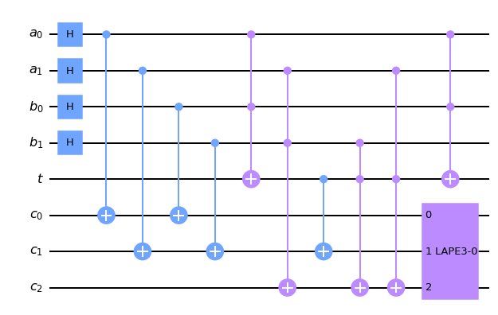
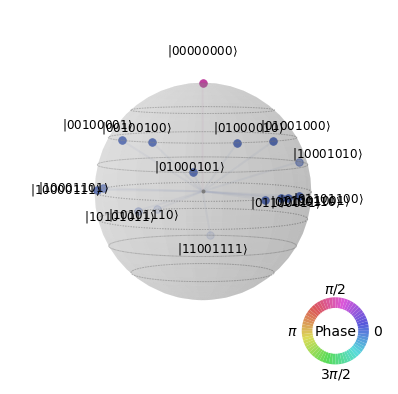
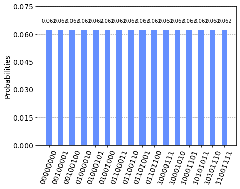
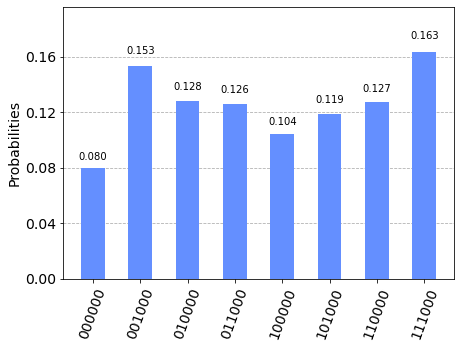
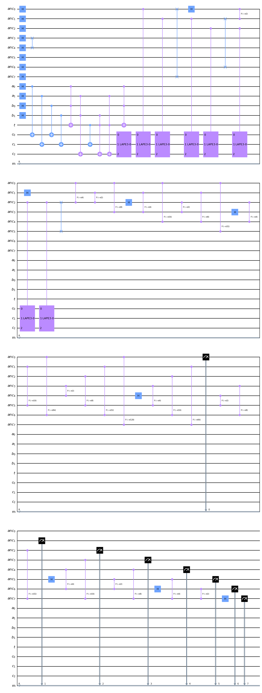
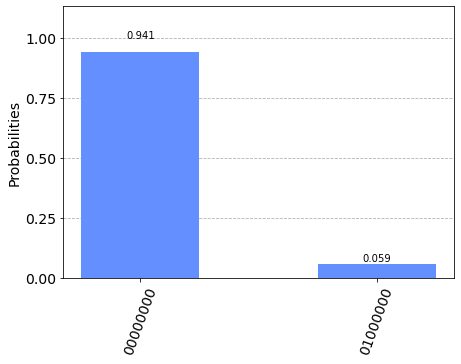

```python
#%matplotlib widget
#%config InlineBackend.figure_format = 'png'

# Importing standard Qiskit libraries
import numpy as np
import math
from math import pi
from qiskit import QuantumCircuit, transpile, Aer, IBMQ,execute, QuantumRegister, ClassicalRegister
from qiskit.tools.jupyter import *
from qiskit.visualization import *
from qiskit.providers.aer import QasmSimulator
from qiskit.circuit.library.standard_gates import HGate, PhaseGate
import QALU
```


```python
sim=Aer.get_backend('statevector_simulator')            

def qft_rotations(circuit, n):
    """Performs qft on the first n qubits in circuit (without swaps)"""
    if n == 0:
        return circuit
    n -= 1
    circuit.h(n)
    for qubit in range(n):
        circuit.cp(pi/2**(n-qubit), qubit, n)
    # At the end of our function, we call the same function again on
    # the next qubits (we reduced n by one earlier in the function)
    qft_rotations(circuit, n)
    
def swap_registers(circuit, n):
    """Swaps registers to match the definition"""
    for qubit in range(n//2):
        circuit.swap(qubit, n-qubit-1)
    return circuit

def qft(circuit, n):
    """QFT on the first n qubits in circuit"""
    qft_rotations(circuit, n)
    swap_registers(circuit, n)
    return circuit

def qft_dagger(qc, n):
    """n-qubit QFTdagger the first n qubits in circ"""
    # Don't forget the Swaps!
    for qubit in range(n//2):
        qc.swap(qubit, n-qubit-1)
    for j in range(n):
        for m in range(j):
            qc.cp(-math.pi/float(2**(j-m)), m, j)
        qc.h(j)
```


```python
def PE(qc, state, p):
    for i in range(2):
        if state[i]=='0':
            qc.x(i)
    qc.cp(np.pi/2, 0,1)
            
    for i in range(2):
        if state[i]=='0':

            qc.x(i)
            
        else:
            pass
            #qc.p(p,i)

def LAPE(enc):#Large Array Phase Encoder
    _=len(enc)
    pe_circ=QuantumCircuit(_,name=f" LAPE{_}-{int(enc,2)}")#LAPE Nomenculature Convention: Lape[x]-[e] where x number of qubits, e is decimal representation of encoded bit string
    
    for i in range(_):
        if enc[i]=="0":
            pe_circ.x(i)
            
    pe_circ.append(PhaseGate(np.pi/2).control(_-1),[i for i in range(_)])
            
    for i in range(len(enc)):
        if enc[i]=="0":
            pe_circ.x(i) 
            
    return pe_circ.to_gate()

def comprehensive_image(qc,path="x.svg"):
    %config InlineBackend.figure_format = 'svg'
    qc.draw("mpl",fold=-1).savefig(path)
    %config InlineBackend.figure_format = 'png'  
```


```python
a=QuantumRegister(2,"a")
b=QuantumRegister(2,"b")
t=QuantumRegister(1,"t")
c=QuantumRegister(3,"c")

qc=QuantumCircuit(a,b,t,c,name="2 qubits adder")

qc.h([i for i in range(4)])

QALU.multi_qubits_adder(qc,(0,1),(2,3),(4,),(5,6,7))
#qc.p(np.pi/3,(5,6,7)
qc.append(LAPE("000"),(5,6,7))
display(qc.draw("mpl"))

adder=qc.to_gate()

sv=execute(qc,sim).result().get_statevector()
display(plot_state_qsphere(sv))
display(plot_histogram(execute(qc,sim).result().get_counts()))

```


    

    


    

    


    

    


## Phase Tracking Mode


```python
a=QuantumRegister(2,"a")
b=QuantumRegister(2,"b")
t=QuantumRegister(1,"t")
c=QuantumRegister(3,"c")
anc=QuantumRegister(6,"anc")

m=ClassicalRegister(6,"m")

ic=QuantumCircuit(anc,a,b,t,c,m)
ic.x(6)
ic.h((7,8,9))
QALU.multi_qubits_adder(ic,(6,7),(8,9),(10,),(11,12,13))
#ic.h((3,4,5,6))
pe=LAPE("000")
ic.append(pe,[11,12,13])

ic.h((0,1,2,3,4,5))

for i in range(3):
    for j in range(2**(i)):
        ic.append(adder.control(1),[i]+[6,7,8,9,10,11,12,13])
        
qft_dagger(ic,6)

ic.measure((0,1,2,3,4,5),(0,1,2,3,4,5))

display(ic.draw("mpl"))

```


    

    


```python
job=execute(ic,sim,shots=1000)
counts=job.result().get_counts()
display(plot_histogram(counts))
print("Angle:",int(tuple(counts.keys())[0][::1],2)/64*180)
```


    

    


    Angle: 0.0


```python
print("Angle:",int("100000",2)/64*180)
```

    Angle: 90.0


```python
job=execute(ic,sim,shots=1000)
```


```python

```


    [ExperimentResult(shots=1000, success=True, meas_level=2, data=ExperimentResultData(counts={'0x8': 269, '0x0': 731}, statevector=Statevector([-0.+0.j,  0.+0.j,  0.+0.j, ...,  0.+0.j,  0.+0.j,  0.+0.j],
                 dims=(2, 2, 2, 2, 2, 2, 2, 2, 2, 2, 2, 2, 2, 2))), header=QobjExperimentHeader(clbit_labels=[['m', 0], ['m', 1], ['m', 2], ['m', 3], ['m', 4], ['m', 5]], creg_sizes=[['m', 6]], global_phase=0.0, memory_slots=6, metadata={}, n_qubits=14, name='circuit-12814', qreg_sizes=[['anc', 6], ['a', 2], ['b', 2], ['t', 1], ['c', 3]], qubit_labels=[['anc', 0], ['anc', 1], ['anc', 2], ['anc', 3], ['anc', 4], ['anc', 5], ['a', 0], ['a', 1], ['b', 0], ['b', 1], ['t', 0], ['c', 0], ['c', 1], ['c', 2]]), status=DONE, seed_simulator=1788214003, metadata={'parallel_state_update': 1, 'noise': 'ideal', 'batched_shots_optimization': False, 'measure_sampling': False, 'device': 'CPU', 'num_qubits': 14, 'parallel_shots': 8, 'remapped_qubits': False, 'method': 'statevector', 'active_input_qubits': [0, 1, 2, 3, 4, 5, 6, 7, 8, 9, 10, 11, 12, 13], 'num_clbits': 6, 'input_qubit_map': [[13, 13], [12, 12], [11, 11], [10, 10], [9, 9], [8, 8], [7, 7], [6, 6], [1, 1], [0, 0], [2, 2], [3, 3], [4, 4], [5, 5]], 'fusion': {'applied': False, 'max_fused_qubits': 5, 'enabled': True, 'threshold': 14}, 'result_types': {'statevector': 'save_statevector'}, 'result_subtypes': {'statevector': 'single'}}, time_taken=2.647404315)]


```python
comprehensive_image(ic)
```


```python
import matplotlib.pyplot as plt
x=np.where(np.asarray(vc)!=0)
x
```


    (array([   0,    1,    2,    3,    4,    5,    6,    7,  264,  265,  266,
             267,  268,  269,  270,  271,  288,  289,  290,  291,  292,  293,
             294,  295,  528,  529,  530,  531,  532,  533,  534,  535,  552,
             553,  554,  555,  556,  557,  558,  559,  576,  577,  578,  579,
             580,  581,  582,  583,  792,  793,  794,  795,  796,  797,  798,
             799,  816,  817,  818,  819,  820,  821,  822,  823,  840,  841,
             842,  843,  844,  845,  846,  847,  864,  865,  866,  867,  868,
             869,  870,  871, 1080, 1081, 1082, 1083, 1084, 1085, 1086, 1087,
            1104, 1105, 1106, 1107, 1108, 1109, 1110, 1111, 1128, 1129, 1130,
            1131, 1132, 1133, 1134, 1135, 1368, 1369, 1370, 1371, 1372, 1373,
            1374, 1375, 1392, 1393, 1394, 1395, 1396, 1397, 1398, 1399, 1656,
            1657, 1658, 1659, 1660, 1661, 1662, 1663]),)


```python
a=QuantumRegister(2,"a")
b=QuantumRegister(2,"b")
t=QuantumRegister(1,"t")
c=QuantumRegister(3,"c")
anc=QuantumRegister(8,"anc")

m=ClassicalRegister(8,"m")

ic=QuantumCircuit(anc,a,b,t,c,m)
ic.h(8)
ic.h((9,10,11))
QALU.multi_qubits_adder(ic,(8,9),(10,11),(12,),(13,14,15))
#ic.h((3,4,5,6))
pe=LAPE("000")
ic.append(pe,(13,14,15))

ic.h((0,1,2,3,4,5,6,7))

for i in range(3):
    for j in range(2**(i)):
        ic.append(pe.control(1),[i,13,14,15])
        
qft_dagger(ic,8)

ic.measure((0,1,2,3,4,5,6,7),(0,1,2,3,4,5,6,7))

display(ic.draw("mpl"))
job=execute(ic,sim,shots=1000)
counts=job.result().get_counts()
display(plot_histogram(counts))
print("Angle:",int(tuple(counts.keys())[0][::1],2)/64*180)
print("Time",job.result().to_dict()['time_taken'])
```


    

    


    

    


    Angle: 180.0
    Time 5.641732454299927


```python
res=job.result()

```


    5.8314642906188965


