# QALU
## A Comprehensive Lecture for Building Blocks
*by Ali Hakim Taşkiran*
- Motivation

- Fundamentals of Digital Electronics
    * Encoding
    * [Logic Gates](https://github.com/QArchs/QALU/blob/main/Lectures-Presentations/Arithmetic%26Logic.pdf)
    * [Boolean Algebra](https://github.com/QArchs/QALU/blob/main/Lectures-Presentations/Arithmetic%26Logic.pdf)
- Linear Maps
- Quantum Paralellism
    * Advantages
    * Copenhagen Interpretation
    * Many Worlds Interpretation
    * Super Determinism
 
- Building QALU
     

### Motivation
   Accelerating parallel processing.
   
 **Example:**
 $$A=\{0, 1, ........., 2^n-1 \},
 \\
 B=\{0, 1, ........., 2^n-1 \} \text{  where n}\in \mathbb{N} 
\\
a \in \mathbb{N}, b \in \mathbb{N}
\\ 
\fbox{a+b=c}
$$
   Consider the case n=2
 
 
 
A={0,1,2,3}

B={0,1,2,3}

<center><b>a+b=c<b></center>

|a|b|c|
| --- | --- | --- |
0|0|0
0|1|1
0|2|2
0|3|3
1|0|1
1|1|2
1|2|3
1|3|4
2|0|2
2|1|3
2|2|4
2|3|5
3|0|3
3|1|4
3|2|5
3|3|6

<center>Table-1</center>

   A classical processor only adds 1 operation at one instance. You need to add extra core for executing more than one at an instance. QALU executes all operations at one execution cycle. To be more concrete; computing all operations in Table-1 while classical processor requires 16 execution cycle, QALU only requires 1. 

## Fundamentals of Digital Electronics
   Digital Electronics is a field for studying digital signals and designing circutiry for processing them.
### Encoding
   Encoding is expressing an information in terms of another form.
   
   <center> Fig-1: A cat</center>
   
   
   
    <center> Fig-2: A dog</center>
    
   cat-->**0** ,  dog --->**1**
   
 Our numbering system also an encoding scheme. Remeber the primary school. You may probably have seen the following.
 <pre>
         🎈   :   1
        🎈🎈   :   2
       🎈🎈🎈   :   3
      🎈🎈🎈🎈   :   4
     🎈🎈🎈🎈🎈   :   5
    🎈🎈🎈🎈🎈🎈   :   6
   🎈🎈🎈🎈🎈🎈🎈   :   7
  🎈🎈🎈🎈🎈🎈🎈🎈   :   8
 🎈🎈🎈🎈🎈🎈🎈🎈🎈   :   9
 </pre>

Each line of the diagram depicts that number of balloons are symbolized accordingly. Symbols are arbitray and it depends on background of the civilization.


   <pre>
         🎈   :   一
        🎈🎈   :   二
       🎈🎈🎈   :   三
      🎈🎈🎈🎈   :   四
     🎈🎈🎈🎈🎈   :   五
    🎈🎈🎈🎈🎈🎈   :   六
   🎈🎈🎈🎈🎈🎈🎈   :   七
  🎈🎈🎈🎈🎈🎈🎈🎈   :   八
 🎈🎈🎈🎈🎈🎈🎈🎈🎈   :   九
   </pre>

Unlike human civilizations, computers as well as quantum computers use base 2, rather 10 or 20. 
 
 <pre>
              🎈   :   1
             🎈🎈   :   10
            🎈🎈🎈   :   11
           🎈🎈🎈🎈   :   100
          🎈🎈🎈🎈🎈   :   101
         🎈🎈🎈🎈🎈🎈   :   110
        🎈🎈🎈🎈🎈🎈🎈   :   111
       🎈🎈🎈🎈🎈🎈🎈🎈   :   1000
      🎈🎈🎈🎈🎈🎈🎈🎈🎈   :   1001
     🎈🎈🎈🎈🎈🎈🎈🎈🎈🎈   :   1010
    🎈🎈🎈🎈🎈🎈🎈🎈🎈🎈🎈   :   1011
   🎈🎈🎈🎈🎈🎈🎈🎈🎈🎈🎈🎈   :   1100
  🎈🎈🎈🎈🎈🎈🎈🎈🎈🎈🎈🎈🎈   :   1101
 🎈🎈🎈🎈🎈🎈🎈🎈🎈🎈🎈🎈🎈🎈   :   1110
 </pre>
 
 In each two increment of number, number gains a new digit. Concretely:
 
 
$0 \xrightarrow{\text{+1}} 1 \xrightarrow{\text{+1}} 10 \xrightarrow{\text{+1}} 11 \xrightarrow{\text{+1}} 100 \xrightarrow{\text{+1}} 101 \xrightarrow{\text{+1}} 110 $

Our number encoding system is presented to aliens by Voyager-2 Golden Disc. You may acquire number encoding skills by understanding the Fig-3


   <center>Fig-3:Voyager Golden Records</center>   

#### Binary-Decimal Conversion

A decimal is converted into a binary as following:

$
\ \ \ \ \ \ \ \ \ \ \ \ \frac{140}{2} \rightarrow\frac{70}{2} \rightarrow\frac{35}{2} \rightarrow\frac{17}{2}\rightarrow\frac{8}{2} \rightarrow\frac{4}{2} \rightarrow\frac{2}{2} \rightarrow\frac{1}{2} 
\\
\ \ \ \ \ \ \ \ \ \ \ \ \ \downarrow\ \ \ \ \ \ \downarrow\ \ \ \ \ \ \downarrow\ \ \ \ \ \ \downarrow\ \ \ \ \ \downarrow\ \ \ \ \downarrow\ \ \ \ \ \downarrow\ \ \ \ \ \downarrow
\\
\ \ \ \ \ \ \ \ \ \ \ \ \underbrace{0}_{LSB}\ \ \ \ \ \ \ \text{0}\ \ \ \ \ \ \ \ \text{1}\ \ \ \ \ \ \ \ \ \text{1}\ \ \ \ \ \ \ \ \text{0}\ \ \ \ \ \ \ \text{0}\ \ \ \ \ \ \ \text{0}\ \ \ \ \ \underbrace{1}_{MSB}
\\
\\
10001100
\ \ \ \ \ \ \ \ \ \ \ \ \ \ \ \ \ \ \ \ \ \ \ \ \ \ \ \ \ \ \ \ \ \ \ \ \ \ \ \ \ \ \ \ \ \ \ \ \ \Bigg\Downarrow\Bigg\Uparrow
\\
\overbrace{0*2^0}^{LSB}+0*2^1 + 1*2^2 + 1*2^3+ 0*2^4+ 0*2^5 +0*2^6+\overbrace{1*2^7}^{MSB}
$


Negative numbers may encoded as following way:
$$
\underbrace{0}_{Sign Bit} \underbrace{1011}_{Magnitude Bits}  \Rightarrow \text{01011}
$$
   There two conventions for signed integer encoding:
   - 1's complement
   - 2's complement
   Since 2's complement form is compatible with processor, 2's complement method will be used.
   Steps for 10->2:
   1. Convert magnitude into binary
   2. Invert all bits
   3. Add 1

In python just use following functions to Binary/Decimal conversions


```python
JustANumber=1902##For the Memory of P.A.M. Dirac
JustABinaryString="11101101110"
print(bin(JustANumber))
print(int(JustABinaryString,2))
```

    0b11101101110
    1902


For boolean algebra, see this [presentation](https://github.com/QArchs/QALU/blob/main/Lectures-Presentations/Arithmetic%26Logic.pdf)
### Imports


```python
%config InlineBackend.figure_format = 'svg'
import numpy as np
import matplotlib.pyplot as plt

from qiskit import QuantumRegister, QuantumCircuit, ClassicalRegister, execute, Aer
from qiskit.visualization import plot_state_qsphere,plot_bloch_multivector
import QALU as qalu
```

## Linear Maps
Linear maps are a mapping between vector spaces. They match some values from $V$ to $W$. They are obiqious and appear everywhere in mathematics, engineering and quantum computing.     

| V | ⇒ | W |
| ---- | ---- |---|
| 0 | |1 |
| 1 | |0 |

$$
\ \ \ \ \ \ \ \ \ \ \ \ \ \ \ \ \overbrace{\begin{pmatrix}0&& 0&& 1&& 0\end{pmatrix}}^{in}
\\
out
\begin{cases}
\begin{pmatrix}0\\1\\0\\0\end{pmatrix}
\begin{pmatrix}
0&&0&&0&&1\\
0&&0&&1&&0\\
0&&1&&0&&0\\
1&&0&&0&&0
\end{pmatrix}
\end{cases}
$$

Matrices are linear maps. They encodes a transformation between vector spaces. Concretely; considering discrete fourier transform, we get frequency and phase data of a signal.
 


```python
t=np.linspace(0,10,1000)
y=np.sin(2*np.pi*t) + np.sin(6*np.pi*t)+.5*np.sin(4*np.pi*t)
f=np.abs(np.fft.fft(y))
fig, ax=plt.subplots(1,2)

ax[0].plot(t[:100],y[:100])
ax[1].plot(t[:40]*10,f[:40])
ax[0].set(title='Time Domain', xlabel='time(sec)', ylabel='amplitude(arb. units)')
ax[1].set(title='Frequency Domain', xlabel='frequency(Hz)')
pass
```


    
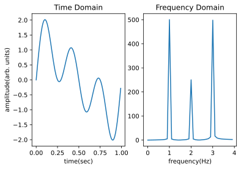
    


Linear maps can be used for differentiation. Derivative of a continious finction is given by $$
f'(x)=\displaystyle{\lim_{h \to 0}}\frac{f(x+h)-f(x)}{h}
$$
In discrete form,
$$
f'(x)=\frac{f(x+h)-f(x)}{s}
$$
where $s$ be discrete steps of the function. 
$$
f=\begin{pmatrix}a\\b\\c\\d\\e\\f\\g\end{pmatrix}\\
\\\ \\
f'=\frac{1}{s}\begin{pmatrix}{b-a}\\{c-b}\\{d-b}\\{e-d}\\f-e\\g-f\end{pmatrix}
\\\ \\
D=\frac{1}{s}\begin{pmatrix}
-1& 1 & 0 & 0 & 0 & 0\\
0&-1&1&0&0&0\\
0&0&-1&1&0&0\\
0&0&0&-1&1&0\\
0&0&0&0&-1&1
\end{pmatrix}
\\\ \\
f'=D\cdot f
$$


Information processing patterns may be embedded into a linear map. Consider the case of readout error. There is a probabilty of being measured as if the qubit is inverted.
<pre>
     ┌───────────────────┐┌─┐
  q: ┤ Initialize(m, n)  ├┤M├
     └───────────────────┘└╥┘
c: 1/══════════════════════╩═
                           0  
</pre>
$$
\overbrace{1}^{measured} \xleftarrow{\epsilon} \fbox{0} \xrightarrow{1-\epsilon} \overbrace{0}^{measured}
\\
\underbrace{0}_{measured} \xleftarrow{\epsilon} \fbox{1} \xrightarrow{1-\epsilon}\underbrace{1}_{measured}
\\
$$
The idea on the diagram may be expressed in terms of matrices. 
Let's define a matrix so that comprise behaviour of unexpected outcome. The matrix is called confusion matrix.

$$
A = 
\begin{pmatrix}
1-\epsilon & \epsilon  \\
\epsilon & 1- \epsilon  
\end{pmatrix}
\\
$$
Assuming 100% true measurement, letting $p$ be probabilty vector, namely, $p=\begin{pmatrix}\langle\Psi\vert\hat{\Pi}_0\vert\Psi\rangle\\ \langle\Psi\vert\hat{\Pi}_1\vert\Psi\rangle \end{pmatrix}=\begin{pmatrix}a\\b\end{pmatrix}$ where $\hat{\Pi}_0\equiv\vert0\rangle\langle0\vert$ an $\hat{\Pi}_1\equiv\vert1\rangle\langle1\vert$ are observables. $p$ becomes $\tilde{p}$, in the presence of readout error and obtained by $$\tilde{p}=F\cdot p $$
The error due to $\epsilon$ may be mitigated by applying inverse of confusion matrix.
$$
p=A^{-1}\cdot \tilde p
$$

This is how matrices used to process the information. 

 ### Using Functions in Quantum Computers
Inserting functions into quantum computers requires encoding and oracle construction. Reason for encoding is that nothing is able to be perform without insterting any suitable information, like cutting air with a pair scissors. Oracle construction is also required because it renders a linear map in quantum circuit which is necessary for executing the function, in other words it converts function into quantum gates.
 * **Basis Encoding**
A number is encoded by converting the number into binary and raising an amplitude on a state whose label is the binary. 
$$
220\xrightarrow[Conversion]{Dec\ to\ Bin}11011100\xrightarrow{Basis\ Encoding}\alpha \vert 11011100 \rangle\\
$$
Inserting oracles, the encoding scheme gets a bit different. We also add ancilary and output qubits into the state. Ancillary qubits are used for temporary processes. Just as a march motor only used to initiate the car and no longer used for displacing the car, ancillary qubits are used for a short. They will no longer used for further phases of the computation. Output qubits are used to carry result of the process and as the input qubits, it carries binary version of the result. 

   $$
\vert \underbrace{10010101110}_{input} \ \underbrace{11101101}_{ancillary}\ \underbrace{11100110}_{output} \rangle
   $$   
   Ordering is arbitrary. 
   
   $$
   \\
\vert \underbrace{10010101110}_{output} \ \underbrace{11101101}_{ancillary}\ \underbrace{11100110}_{input} \rangle
   $$

If we attempt to perform $p\land q$ logic operation, it is encoded as following:
$$
\vert p,q,p\land q\rangle
$$
and associated linear map is following
$$
\overbrace{\begin{pmatrix}\vert 000 \rangle&&\vert 001 \rangle&&\vert 010 \rangle&&\vert 011 \rangle&&\vert 100 \rangle&&\vert 101 \rangle&&\vert 110 \rangle&&\vert 111 \rangle\end{pmatrix}}^{in}
\\
out
\begin{cases}
\begin{pmatrix}\vert 000 \rangle\\\vert 001 \rangle\\\vert 010 \rangle\\\vert 011 \rangle\\\vert 100 \rangle\\\vert 101 \rangle\\\vert 110 \rangle\\\vert 111 \rangle\end{pmatrix}
\begin{pmatrix}
1&&0&&0&&0&&0&&0&&0&&0\\
0&&1&&0&&0&&0&&0&&0&&0\\
0&&0&&1&&0&&0&&0&&0&&0\\
0&&0&&0&&0&&0&&0&&0&&0\\
0&&0&&0&&0&&0&&0&&0&&0\\
0&&0&&0&&0&&0&&0&&0&&0\\
0&&0&&0&&0&&0&&0&&0&&0\\
0&&0&&0&&1&&0&&0&&0&&0\\
\end{pmatrix}
\end{cases}
$$


## Quantum Parallelism
 Quantum parallelism is a type of multiprocessing which utilizes superposition. Concretely, a lot of variable may inserted into a function simulataneously. 
 $$
 f(x,y)=x*y
 $$  
 
 | x | y |f(x,y)|
| --- | ----------- |------|
| 0 | 0 | 0|
| 0 | 1 |0|
| 1 | 0|0|
|1|1|1|

Whole table is inserted into the function. Explicitly
$$
f(\begin{pmatrix}0,0\\0,1\\1,0\\1,1\end{pmatrix})=\begin{pmatrix}0\\0\\0\\1\end{pmatrix}
$$

Backbone of the quantum parallelism is Hadamard gate ( $\fbox{H}$ ). Hadamard gates superpose $\vert0\rangle$ accordingly,
$$
H=\begin{pmatrix}
1 & 1\\ 
1 & -1
\end{pmatrix}
\\H\vert0\rangle=\frac{1}{\sqrt{2}}(\vert0\rangle+\vert1\rangle)
$$


```python
qc=QuantumCircuit(1)
qc.h(0)
display(qc.draw("mpl"))
sim=Aer.get_backend('statevector_simulator')
plot_state_qsphere(execute(qc,sim).result().get_statevector())
```


    
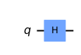
    


    
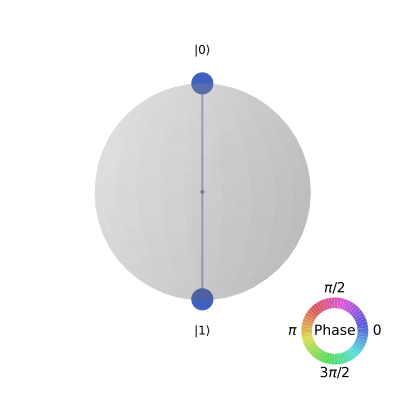
    


Adding Hadamard gate multiqubits yields superposition of many states. Applying $\fbox{H}$ gates to $N$ qubits, superposition of $2^N$ are obtained. In this case, many Hadamard gates are denoted as 
$$
H_n\equiv H^{\otimes N}
$$


```python
qc=QuantumCircuit(2)
qc.h((0,1))
display(qc.draw("mpl"))
sim=Aer.get_backend('statevector_simulator')
plot_state_qsphere(execute(qc,sim).result().get_statevector())
```


    
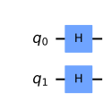
    


    
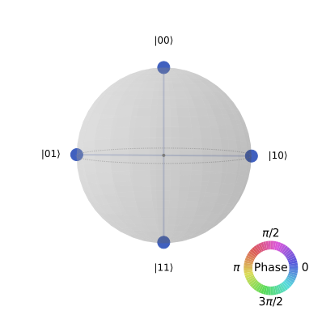
    


Applying the oracle(it is just CCX gate in this case) , all possible values that can be insterted into the oracle are simultaneously computed. Encoding of the state is $\vert out_0 ,\ in_0, in_1\rangle$.(by qiskit's qubit ordering convention)


```python
qc=QuantumCircuit(3)
qc.h((0,1))
qc.ccx(0,1,2)
display(qc.draw("mpl"))
sim=Aer.get_backend('statevector_simulator')
plot_state_qsphere(execute(qc,sim).result().get_statevector())
```


    
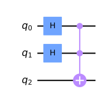
    


    
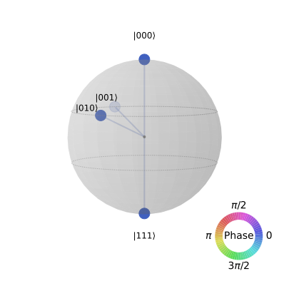
    


This is the essence of the QALU. It is not necessarly different than the circuit above. Adding an oracle that performs addition, we can compute all possible addition operations simultaneously.


```python
qc=QuantumCircuit(2,name='LACE2-1($3\pi/2$)')
qc.x(0)
qc.cp(3*np.pi/2,0,1)
qc.x(0)
LACE=qc.to_gate()

qc=QuantumCircuit(2)
qc.h((0,1))
qc.append(LACE,(0,1))
display(qc.draw("mpl"))

sim=Aer.get_backend('statevector_simulator')
plot_state_qsphere(execute(qc,sim).result().get_statevector())
```


    
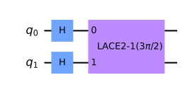
    


    
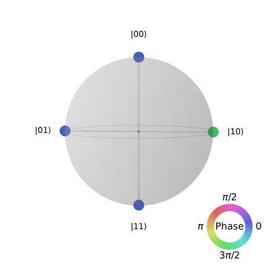
    


### Copenhagen Interpretation of Quantum Mechanics
  This is which formalism that you use generally about quantum mechanics. According to Copenhagen Interpretation, nature is intrinsically indeterministic and probabilistic. Behaviour of the particles are different until they are observed. Measurement cause wave function to 'collapse'. Probability of a state given by squared ampltide, namely Born Rule, formally $p=\Psi\Psi^{\dagger}$. Copenhagen Interpretation claims that all possible states evolves simultaneously in the oracle. When the state is observed, a certain outcome is obtained.   
### Many Worlds Interpretations of Quantum Mechanics
  Many Worlds Interpretation states that wave function($\Psi$) doesn't collapse when it is observed. Other outcomes of measurement lives in another universe. Likely, sample space is realy a cluster of universes. Hence; observing something, copy of the observer living in a different universe may observe something different. According to Many Worlds Interpretation, there are many oracles in different universes and since an ordinary observer can't observe other universes, they get only a certain outcome.
### Super Determinism
  Super Determinism states that all phenomenons are determined before creation of the universe. This means the universe is completely video. It claims that parallel computing power of the quantum mechanics is originated from video renderer of the whole universe.


#### Simulation Environment


```python
be=Aer.get_backend("statevector_simulator")
```

## AND Gate


```python
a=QuantumRegister(1,"a")
b=QuantumRegister(1,"b")
c=QuantumRegister(1,"out")
qc=QuantumCircuit(a,b,c)

qalu.and_(qc,0,1,2)
qc.draw("mpl")
```


    
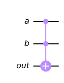
    


## OR Gate


```python
a=QuantumRegister(1,"a")
b=QuantumRegister(1,"b")
c=QuantumRegister(1,"out")
qc=QuantumCircuit(a,b,c)

qalu.or_(qc,0,1,2)
qc.draw("mpl")
```


    
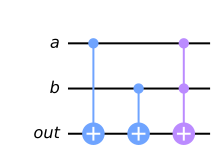
    


## XOR Gate


```python
a=QuantumRegister(1,"a")
b=QuantumRegister(1,"b")
c=QuantumRegister(1,"out")
qc=QuantumCircuit(a,b,c)

qalu.xor_(qc,0,1,2)
qc.draw("mpl")
```


    
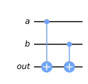
    


## NAND Gate


```python
a=QuantumRegister(1,"a")
b=QuantumRegister(1,"b")
c=QuantumRegister(1,"out")
qc=QuantumCircuit(a,b,c)

qalu.nand_(qc,0,1,2)
qc.draw("mpl")
```


    
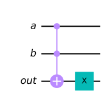
    


## NOR Gate


```python
a=QuantumRegister(1,"a")
b=QuantumRegister(1,"b")
c=QuantumRegister(1,"out")
qc=QuantumCircuit(a,b,c)

qalu.nor_(qc,0,1,2)
qc.draw("mpl")
```


    
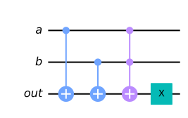
    


## XNOR Gate


```python
a=QuantumRegister(1,"a")
b=QuantumRegister(1,"b")
c=QuantumRegister(1,"out")
qc=QuantumCircuit(a,b,c)

qalu.xnor_(qc,0,1,2)
qc.draw("mpl")
```


    
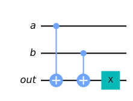
    


## Visualize the gates


```python
a=QuantumRegister(1,"a")
b=QuantumRegister(1,"b")
c=QuantumRegister(1,"out")

qc=QuantumCircuit(a,b,c)
qc.h(0)
qc.h(1)
and_(qc,0,1,2)
display("AND",qc.draw("mpl"))
display(plot_state_qsphere(execute(qc,be).result().get_statevector()))

a=QuantumRegister(1,"a")
b=QuantumRegister(1,"b")
c=QuantumRegister(1,"out")

qc=QuantumCircuit(a,b,c)
qc.h(0)
qc.h(1)
nand_(qc,0,1,2)
display("NAND",qc.draw("mpl"))
display(plot_state_qsphere(execute(qc,be).result().get_statevector()))

a=QuantumRegister(1,"a")
b=QuantumRegister(1,"b")
c=QuantumRegister(1,"out")

qc=QuantumCircuit(a,b,c)
qc.h(0)
qc.h(1)
or_(qc,0,1,2)
display("OR",qc.draw("mpl"))
display(plot_state_qsphere(execute(qc,be).result().get_statevector()))

a=QuantumRegister(1,"a")
b=QuantumRegister(1,"b")
c=QuantumRegister(1,"out")

qc=QuantumCircuit(a,b,c)
qc.h(0)
qc.h(1)
nor_(qc,0,1,2)
display("NOR",qc.draw("mpl"))
display(plot_state_qsphere(execute(qc,be).result().get_statevector()))

a=QuantumRegister(1,"a")
b=QuantumRegister(1,"b")
c=QuantumRegister(1,"out")

qc=QuantumCircuit(a,b,c)
qc.h(0)
qc.h(1)
xor_(qc,0,1,2)
display("XOR",qc.draw("mpl"))
display(plot_state_qsphere(execute(qc,be).result().get_statevector()))

a=QuantumRegister(1,"a")
b=QuantumRegister(1,"b")
c=QuantumRegister(1,"out")

qc=QuantumCircuit(a,b,c)
qc.h(0)
qc.h(1)
xnor_(qc,0,1,2)
display("XNOR",qc.draw("mpl"))
display(plot_state_qsphere(execute(qc,be).result().get_statevector()))
```


    'AND'


    
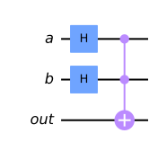
    


    

    


    'NAND'


    
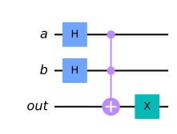
    


    

    


    'OR'


    
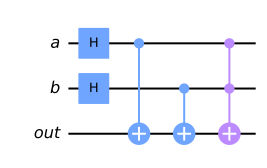
    


    
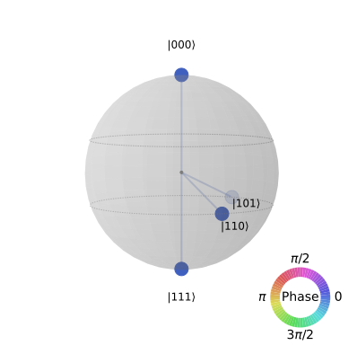
    


    'NOR'


    
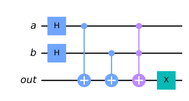
    


    
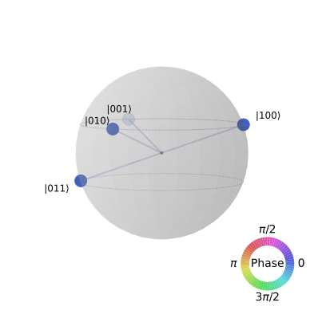
    


    'XOR'


    
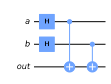
    


    
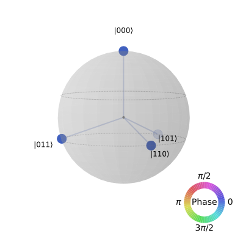
    


    'XNOR'


    
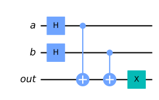
    


    
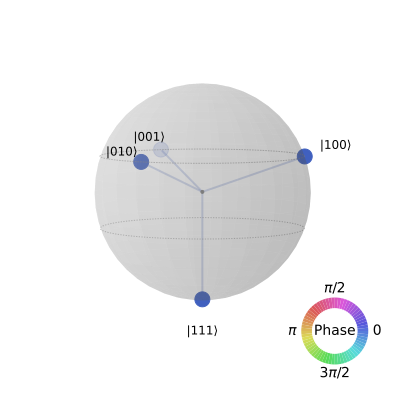
    


## Visualise Arithmetic Operations


```python
a=QuantumRegister(1,"a")
b=QuantumRegister(1,"b")
c=QuantumRegister(1,"c")
out=QuantumRegister(1,"out")

qc=QuantumCircuit(a,b,c,out)
qc.h(0)
qc.h(1)

qalu.half_adder(qc,0,1,2,3)
display("HALF ADDER",qc.draw("mpl"))
display(plot_state_qsphere(execute(qc,be).result().get_statevector()))


a=QuantumRegister(1,"a")
b=QuantumRegister(1,"b")
c_in=QuantumRegister(1,"cin")
c_out=QuantumRegister(1,"cout")
sum_=QuantumRegister(1,"sum")

qc=QuantumCircuit(a,b,c_in,c_out,sum_)
qc.h(0)
qc.h(1)
qc.h(2)

qalu.full_adder(qc,0,1,2,3,4)
display("FULL ADDER",qc.draw("mpl"))
display(plot_state_qsphere(execute(qc,be).result().get_statevector()))


a=QuantumRegister(1,"a")
b=QuantumRegister(1,"b")
c=QuantumRegister(1,"c")
out=QuantumRegister(1,"out")

qc=QuantumCircuit(a,b,c,out)
qc.h(0)
qc.h(1)

qalu.half_subtractor(qc,0,1,2,3)
display("HALF SUBTRACTOR",qc.draw("mpl"))
display(plot_state_qsphere(execute(qc,be).result().get_statevector()))


a=QuantumRegister(1,"a")
b=QuantumRegister(1,"b")
b_in=QuantumRegister(1,"bin")
b_out=QuantumRegister(1,"bout")
diff=QuantumRegister(1,"diff")

qc=QuantumCircuit(a,b,b_in,b_out,diff)
qc.h(0)
qc.h(1)
qc.h(2)

qalu.full_subtractor(qc,0,1,2,3,4)
display("FULL SUBTRACTOR",qc.draw("mpl"))
display(plot_state_qsphere(execute(qc,be).result().get_statevector()))

```


    'HALF ADDER'


    
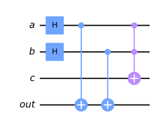
    


    
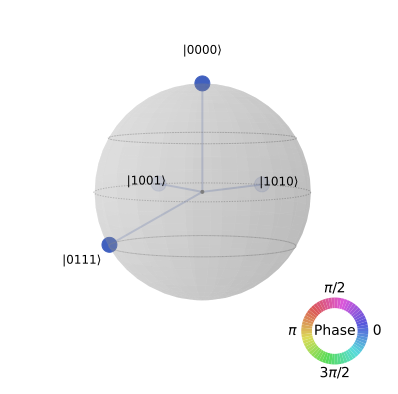
    


    'FULL ADDER'


    

    


    
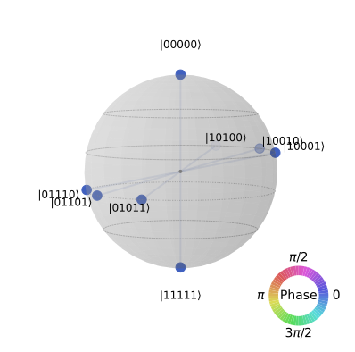
    


    'HALF SUBTRACTOR'


    
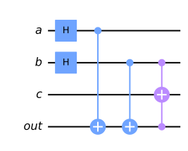
    


    
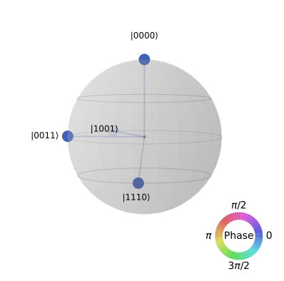
    


    'FULL SUBTRACTOR'


    
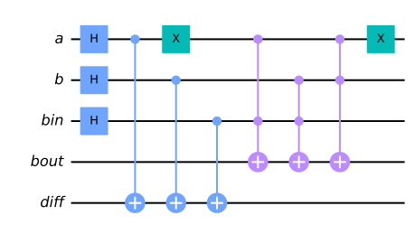
    


    
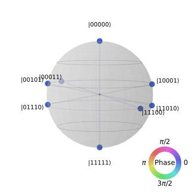
    


## Multi Qubits Adder


```python
#Function for extracting addition operations from statevector
def extract(sv,q,t):#sv:statevector, q: # of qubits, t:number of temporaries
    probs=[]
    for i in range(len(sv)):
        if not sv[i]==0:
            probs.append([i,abs(sv[i])**2])
    for i in range(len(probs)):
        probs[i][0]=bin(probs[i][0])[2:]
        probs[i][0]="0"*(3*q+1+t-len((probs[i][0])))+probs[i][0]
    
    for i in range(len(probs)):
        probs[i].append(probs[i][0][:q+1]+"-"+probs[i][0][q+1:t+q+1]+"-"+probs[i][0][q+t+1:2*q+t+1]+"-"+probs[i][0][2*q+t+1:3*q+t+1])
    for i in range(len(probs)):
        m=""
        t=probs[i][2].split("-")
        m+=str(int(t[0],2))+"="+str(int(t[2],2))+"+"+str(int(t[3],2))
        probs[i].append(m)
            
    return probs

a=QuantumRegister(4,"a")
b=QuantumRegister(4,"b")
t=QuantumRegister(3,"t")
c=QuantumRegister(5,"c")
qc=QuantumCircuit(a,b,t,c)
qc.h([i for i in range(8)])
qalu.multi_qubits_adder(qc,(0,1,2,3),(4,5,6,7),(8,9,10),(11,12,13,14,15))
display(qc.draw("mpl",fold=-1))
sv=execute(qc,be).result().get_statevector()
n=extract(sv,4,3)
print("# of performed simultaneously operations is",len(n))
n
```


    
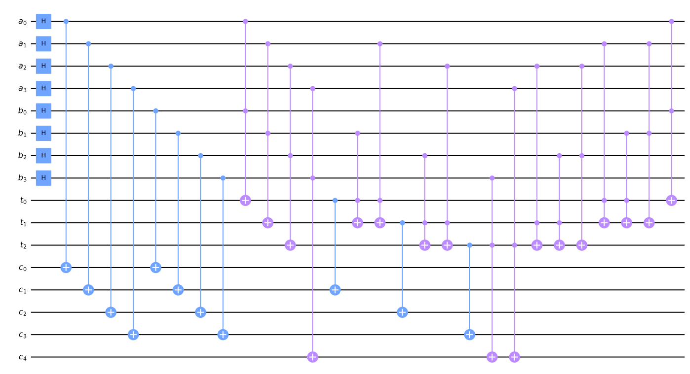
    


    # of performed simultaneously operations is 256


    /tmp/ipykernel_13937/535795790.py:4: DeprecationWarning: The return type of saved statevectors has been changed from a `numpy.ndarray` to a `qiskit.quantum_info.Statevector` as of qiskit-aer 0.10. Accessing numpy array attributes is deprecated and will result in an error in a future release. To continue using saved result objects as arrays you can explicitly cast them using  `np.asarray(object)`.
      for i in range(len(sv)):


    [['0000000000000000', 0.003906250000000007, '00000-000-0000-0000', '0=0+0'],
     ['0000100000000001', 0.003906250000000005, '00001-000-0000-0001', '1=0+1'],
     ['0000100000010000', 0.003906250000000005, '00001-000-0001-0000', '1=1+0'],
     ['0001000000000010', 0.003906250000000005, '00010-000-0000-0010', '2=0+2'],
     ['0001000000010001', 0.0039062500000000035, '00010-000-0001-0001', '2=1+1'],
     ['0001000000100000', 0.003906250000000005, '00010-000-0010-0000', '2=2+0'],
     ['0001100000000011', 0.0039062500000000035, '00011-000-0000-0011', '3=0+3'],
     ['0001100000010010', 0.0039062500000000035, '00011-000-0001-0010', '3=1+2'],
     ['0001100000100001', 0.0039062500000000035, '00011-000-0010-0001', '3=2+1'],
     ['0001100000110000', 0.0039062500000000035, '00011-000-0011-0000', '3=3+0'],
     ['0010000000000100', 0.003906250000000005, '00100-000-0000-0100', '4=0+4'],
     ['0010000000010011', 0.003906250000000002, '00100-000-0001-0011', '4=1+3'],
     ['0010000000100010', 0.0039062500000000035, '00100-000-0010-0010', '4=2+2'],
     ['0010000000110001', 0.003906250000000002, '00100-000-0011-0001', '4=3+1'],
     ['0010000001000000', 0.003906250000000005, '00100-000-0100-0000', '4=4+0'],
     ['0010100000000101', 0.0039062500000000035, '00101-000-0000-0101', '5=0+5'],
     ['0010100000010100', 0.0039062500000000035, '00101-000-0001-0100', '5=1+4'],
     ['0010100000100011', 0.003906250000000002, '00101-000-0010-0011', '5=2+3'],
     ['0010100000110010', 0.003906250000000002, '00101-000-0011-0010', '5=3+2'],
     ['0010100001000001', 0.0039062500000000035, '00101-000-0100-0001', '5=4+1'],
     ['0010100001010000', 0.0039062500000000035, '00101-000-0101-0000', '5=5+0'],
     ['0011000000000110', 0.0039062500000000035, '00110-000-0000-0110', '6=0+6'],
     ['0011000000010101', 0.003906250000000002, '00110-000-0001-0101', '6=1+5'],
     ['0011000000100100', 0.0039062500000000035, '00110-000-0010-0100', '6=2+4'],
     ['0011000000110011', 0.00390625, '00110-000-0011-0011', '6=3+3'],
     ['0011000001000010', 0.0039062500000000035, '00110-000-0100-0010', '6=4+2'],
     ['0011000001010001', 0.003906250000000002, '00110-000-0101-0001', '6=5+1'],
     ['0011000001100000', 0.0039062500000000035, '00110-000-0110-0000', '6=6+0'],
     ['0011100000000111', 0.003906250000000002, '00111-000-0000-0111', '7=0+7'],
     ['0011100000010110', 0.003906250000000002, '00111-000-0001-0110', '7=1+6'],
     ['0011100000100101', 0.003906250000000002, '00111-000-0010-0101', '7=2+5'],
     ['0011100000110100', 0.003906250000000002, '00111-000-0011-0100', '7=3+4'],
     ['0011100001000011', 0.003906250000000002, '00111-000-0100-0011', '7=4+3'],
     ['0011100001010010', 0.003906250000000002, '00111-000-0101-0010', '7=5+2'],
     ['0011100001100001', 0.003906250000000002, '00111-000-0110-0001', '7=6+1'],
     ['0011100001110000', 0.003906250000000002, '00111-000-0111-0000', '7=7+0'],
     ['0100000000001000', 0.003906250000000005, '01000-000-0000-1000', '8=0+8'],
     ['0100000000010111', 0.00390625, '01000-000-0001-0111', '8=1+7'],
     ['0100000000100110', 0.003906250000000002, '01000-000-0010-0110', '8=2+6'],
     ['0100000000110101', 0.00390625, '01000-000-0011-0101', '8=3+5'],
     ['0100000001000100', 0.0039062500000000035, '01000-000-0100-0100', '8=4+4'],
     ['0100000001010011', 0.00390625, '01000-000-0101-0011', '8=5+3'],
     ['0100000001100010', 0.003906250000000002, '01000-000-0110-0010', '8=6+2'],
     ['0100000001110001', 0.00390625, '01000-000-0111-0001', '8=7+1'],
     ['0100000010000000', 0.003906250000000005, '01000-000-1000-0000', '8=8+0'],
     ['0100100000001001', 0.0039062500000000035, '01001-000-0000-1001', '9=0+9'],
     ['0100100000011000', 0.0039062500000000035, '01001-000-0001-1000', '9=1+8'],
     ['0100100000100111', 0.00390625, '01001-000-0010-0111', '9=2+7'],
     ['0100100000110110', 0.00390625, '01001-000-0011-0110', '9=3+6'],
     ['0100100001000101', 0.003906250000000002, '01001-000-0100-0101', '9=4+5'],
     ['0100100001010100', 0.003906250000000002, '01001-000-0101-0100', '9=5+4'],
     ['0100100001100011', 0.00390625, '01001-000-0110-0011', '9=6+3'],
     ['0100100001110010', 0.00390625, '01001-000-0111-0010', '9=7+2'],
     ['0100100010000001', 0.0039062500000000035, '01001-000-1000-0001', '9=8+1'],
     ['0100100010010000', 0.0039062500000000035, '01001-000-1001-0000', '9=9+0'],
     ['0101000000001010', 0.0039062500000000035, '01010-000-0000-1010', '10=0+10'],
     ['0101000000011001', 0.003906250000000002, '01010-000-0001-1001', '10=1+9'],
     ['0101000000101000', 0.0039062500000000035, '01010-000-0010-1000', '10=2+8'],
     ['0101000000110111', 0.0039062499999999983, '01010-000-0011-0111', '10=3+7'],
     ['0101000001000110', 0.003906250000000002, '01010-000-0100-0110', '10=4+6'],
     ['0101000001010101', 0.00390625, '01010-000-0101-0101', '10=5+5'],
     ['0101000001100100', 0.003906250000000002, '01010-000-0110-0100', '10=6+4'],
     ['0101000001110011', 0.0039062499999999983, '01010-000-0111-0011', '10=7+3'],
     ['0101000010000010', 0.0039062500000000035, '01010-000-1000-0010', '10=8+2'],
     ['0101000010010001', 0.003906250000000002, '01010-000-1001-0001', '10=9+1'],
     ['0101000010100000', 0.0039062500000000035, '01010-000-1010-0000', '10=10+0'],
     ['0101100000001011', 0.003906250000000002, '01011-000-0000-1011', '11=0+11'],
     ['0101100000011010', 0.003906250000000002, '01011-000-0001-1010', '11=1+10'],
     ['0101100000101001', 0.003906250000000002, '01011-000-0010-1001', '11=2+9'],
     ['0101100000111000', 0.003906250000000002, '01011-000-0011-1000', '11=3+8'],
     ['0101100001000111', 0.00390625, '01011-000-0100-0111', '11=4+7'],
     ['0101100001010110', 0.00390625, '01011-000-0101-0110', '11=5+6'],
     ['0101100001100101', 0.00390625, '01011-000-0110-0101', '11=6+5'],
     ['0101100001110100', 0.00390625, '01011-000-0111-0100', '11=7+4'],
     ['0101100010000011', 0.003906250000000002, '01011-000-1000-0011', '11=8+3'],
     ['0101100010010010', 0.003906250000000002, '01011-000-1001-0010', '11=9+2'],
     ['0101100010100001', 0.003906250000000002, '01011-000-1010-0001', '11=10+1'],
     ['0101100010110000', 0.003906250000000002, '01011-000-1011-0000', '11=11+0'],
     ['0110000000001100', 0.0039062500000000035, '01100-000-0000-1100', '12=0+12'],
     ['0110000000011011', 0.00390625, '01100-000-0001-1011', '12=1+11'],
     ['0110000000101010', 0.003906250000000002, '01100-000-0010-1010', '12=2+10'],
     ['0110000000111001', 0.00390625, '01100-000-0011-1001', '12=3+9'],
     ['0110000001001000', 0.0039062500000000035, '01100-000-0100-1000', '12=4+8'],
     ['0110000001010111', 0.0039062499999999983, '01100-000-0101-0111', '12=5+7'],
     ['0110000001100110', 0.00390625, '01100-000-0110-0110', '12=6+6'],
     ['0110000001110101', 0.0039062499999999983, '01100-000-0111-0101', '12=7+5'],
     ['0110000010000100', 0.0039062500000000035, '01100-000-1000-0100', '12=8+4'],
     ['0110000010010011', 0.00390625, '01100-000-1001-0011', '12=9+3'],
     ['0110000010100010', 0.003906250000000002, '01100-000-1010-0010', '12=10+2'],
     ['0110000010110001', 0.00390625, '01100-000-1011-0001', '12=11+1'],
     ['0110000011000000', 0.0039062500000000035, '01100-000-1100-0000', '12=12+0'],
     ['0110100000001101', 0.003906250000000002, '01101-000-0000-1101', '13=0+13'],
     ['0110100000011100', 0.003906250000000002, '01101-000-0001-1100', '13=1+12'],
     ['0110100000101011', 0.00390625, '01101-000-0010-1011', '13=2+11'],
     ['0110100000111010', 0.00390625, '01101-000-0011-1010', '13=3+10'],
     ['0110100001001001', 0.003906250000000002, '01101-000-0100-1001', '13=4+9'],
     ['0110100001011000', 0.003906250000000002, '01101-000-0101-1000', '13=5+8'],
     ['0110100001100111', 0.0039062499999999983, '01101-000-0110-0111', '13=6+7'],
     ['0110100001110110', 0.0039062499999999983, '01101-000-0111-0110', '13=7+6'],
     ['0110100010000101', 0.003906250000000002, '01101-000-1000-0101', '13=8+5'],
     ['0110100010010100', 0.003906250000000002, '01101-000-1001-0100', '13=9+4'],
     ['0110100010100011', 0.00390625, '01101-000-1010-0011', '13=10+3'],
     ['0110100010110010', 0.00390625, '01101-000-1011-0010', '13=11+2'],
     ['0110100011000001', 0.003906250000000002, '01101-000-1100-0001', '13=12+1'],
     ['0110100011010000', 0.003906250000000002, '01101-000-1101-0000', '13=13+0'],
     ['0111000000001110', 0.003906250000000002, '01110-000-0000-1110', '14=0+14'],
     ['0111000000011101', 0.00390625, '01110-000-0001-1101', '14=1+13'],
     ['0111000000101100', 0.003906250000000002, '01110-000-0010-1100', '14=2+12'],
     ['0111000000111011', 0.0039062499999999983, '01110-000-0011-1011', '14=3+11'],
     ['0111000001001010', 0.003906250000000002, '01110-000-0100-1010', '14=4+10'],
     ['0111000001011001', 0.00390625, '01110-000-0101-1001', '14=5+9'],
     ['0111000001101000', 0.003906250000000002, '01110-000-0110-1000', '14=6+8'],
     ['0111000001110111', 0.0039062499999999965, '01110-000-0111-0111', '14=7+7'],
     ['0111000010000110', 0.003906250000000002, '01110-000-1000-0110', '14=8+6'],
     ['0111000010010101', 0.00390625, '01110-000-1001-0101', '14=9+5'],
     ['0111000010100100', 0.003906250000000002, '01110-000-1010-0100', '14=10+4'],
     ['0111000010110011', 0.0039062499999999983, '01110-000-1011-0011', '14=11+3'],
     ['0111000011000010', 0.003906250000000002, '01110-000-1100-0010', '14=12+2'],
     ['0111000011010001', 0.00390625, '01110-000-1101-0001', '14=13+1'],
     ['0111000011100000', 0.003906250000000002, '01110-000-1110-0000', '14=14+0'],
     ['0111100000001111', 0.00390625, '01111-000-0000-1111', '15=0+15'],
     ['0111100000011110', 0.00390625, '01111-000-0001-1110', '15=1+14'],
     ['0111100000101101', 0.00390625, '01111-000-0010-1101', '15=2+13'],
     ['0111100000111100', 0.00390625, '01111-000-0011-1100', '15=3+12'],
     ['0111100001001011', 0.00390625, '01111-000-0100-1011', '15=4+11'],
     ['0111100001011010', 0.00390625, '01111-000-0101-1010', '15=5+10'],
     ['0111100001101001', 0.00390625, '01111-000-0110-1001', '15=6+9'],
     ['0111100001111000', 0.00390625, '01111-000-0111-1000', '15=7+8'],
     ['0111100010000111', 0.00390625, '01111-000-1000-0111', '15=8+7'],
     ['0111100010010110', 0.00390625, '01111-000-1001-0110', '15=9+6'],
     ['0111100010100101', 0.00390625, '01111-000-1010-0101', '15=10+5'],
     ['0111100010110100', 0.00390625, '01111-000-1011-0100', '15=11+4'],
     ['0111100011000011', 0.00390625, '01111-000-1100-0011', '15=12+3'],
     ['0111100011010010', 0.00390625, '01111-000-1101-0010', '15=13+2'],
     ['0111100011100001', 0.00390625, '01111-000-1110-0001', '15=14+1'],
     ['0111100011110000', 0.00390625, '01111-000-1111-0000', '15=15+0'],
     ['1000000000011111', 0.0039062499999999983, '10000-000-0001-1111', '16=1+15'],
     ['1000000000101110', 0.00390625, '10000-000-0010-1110', '16=2+14'],
     ['1000000000111101', 0.0039062499999999983, '10000-000-0011-1101', '16=3+13'],
     ['1000000001001100', 0.003906250000000002, '10000-000-0100-1100', '16=4+12'],
     ['1000000001011011', 0.0039062499999999983, '10000-000-0101-1011', '16=5+11'],
     ['1000000001101010', 0.00390625, '10000-000-0110-1010', '16=6+10'],
     ['1000000001111001', 0.0039062499999999983, '10000-000-0111-1001', '16=7+9'],
     ['1000000010001000', 0.0039062500000000035, '10000-000-1000-1000', '16=8+8'],
     ['1000000010010111', 0.0039062499999999983, '10000-000-1001-0111', '16=9+7'],
     ['1000000010100110', 0.00390625, '10000-000-1010-0110', '16=10+6'],
     ['1000000010110101', 0.0039062499999999983, '10000-000-1011-0101', '16=11+5'],
     ['1000000011000100', 0.003906250000000002, '10000-000-1100-0100', '16=12+4'],
     ['1000000011010011', 0.0039062499999999983, '10000-000-1101-0011', '16=13+3'],
     ['1000000011100010', 0.00390625, '10000-000-1110-0010', '16=14+2'],
     ['1000000011110001', 0.0039062499999999983, '10000-000-1111-0001', '16=15+1'],
     ['1000100000101111', 0.0039062499999999983, '10001-000-0010-1111', '17=2+15'],
     ['1000100000111110', 0.0039062499999999983, '10001-000-0011-1110', '17=3+14'],
     ['1000100001001101', 0.00390625, '10001-000-0100-1101', '17=4+13'],
     ['1000100001011100', 0.00390625, '10001-000-0101-1100', '17=5+12'],
     ['1000100001101011', 0.0039062499999999983, '10001-000-0110-1011', '17=6+11'],
     ['1000100001111010', 0.0039062499999999983, '10001-000-0111-1010', '17=7+10'],
     ['1000100010001001', 0.003906250000000002, '10001-000-1000-1001', '17=8+9'],
     ['1000100010011000', 0.003906250000000002, '10001-000-1001-1000', '17=9+8'],
     ['1000100010100111', 0.0039062499999999983, '10001-000-1010-0111', '17=10+7'],
     ['1000100010110110', 0.0039062499999999983, '10001-000-1011-0110', '17=11+6'],
     ['1000100011000101', 0.00390625, '10001-000-1100-0101', '17=12+5'],
     ['1000100011010100', 0.00390625, '10001-000-1101-0100', '17=13+4'],
     ['1000100011100011', 0.0039062499999999983, '10001-000-1110-0011', '17=14+3'],
     ['1000100011110010', 0.0039062499999999983, '10001-000-1111-0010', '17=15+2'],
     ['1001000000111111', 0.0039062499999999965, '10010-000-0011-1111', '18=3+15'],
     ['1001000001001110', 0.00390625, '10010-000-0100-1110', '18=4+14'],
     ['1001000001011101', 0.0039062499999999983, '10010-000-0101-1101', '18=5+13'],
     ['1001000001101100', 0.00390625, '10010-000-0110-1100', '18=6+12'],
     ['1001000001111011', 0.0039062499999999965, '10010-000-0111-1011', '18=7+11'],
     ['1001000010001010', 0.003906250000000002, '10010-000-1000-1010', '18=8+10'],
     ['1001000010011001', 0.00390625, '10010-000-1001-1001', '18=9+9'],
     ['1001000010101000', 0.003906250000000002, '10010-000-1010-1000', '18=10+8'],
     ['1001000010110111', 0.0039062499999999965, '10010-000-1011-0111', '18=11+7'],
     ['1001000011000110', 0.00390625, '10010-000-1100-0110', '18=12+6'],
     ['1001000011010101', 0.0039062499999999983, '10010-000-1101-0101', '18=13+5'],
     ['1001000011100100', 0.00390625, '10010-000-1110-0100', '18=14+4'],
     ['1001000011110011', 0.0039062499999999965, '10010-000-1111-0011', '18=15+3'],
     ['1001100001001111', 0.0039062499999999983, '10011-000-0100-1111', '19=4+15'],
     ['1001100001011110', 0.0039062499999999983, '10011-000-0101-1110', '19=5+14'],
     ['1001100001101101', 0.0039062499999999983, '10011-000-0110-1101', '19=6+13'],
     ['1001100001111100', 0.0039062499999999983, '10011-000-0111-1100', '19=7+12'],
     ['1001100010001011', 0.00390625, '10011-000-1000-1011', '19=8+11'],
     ['1001100010011010', 0.00390625, '10011-000-1001-1010', '19=9+10'],
     ['1001100010101001', 0.00390625, '10011-000-1010-1001', '19=10+9'],
     ['1001100010111000', 0.00390625, '10011-000-1011-1000', '19=11+8'],
     ['1001100011000111', 0.0039062499999999983, '10011-000-1100-0111', '19=12+7'],
     ['1001100011010110', 0.0039062499999999983, '10011-000-1101-0110', '19=13+6'],
     ['1001100011100101', 0.0039062499999999983, '10011-000-1110-0101', '19=14+5'],
     ['1001100011110100', 0.0039062499999999983, '10011-000-1111-0100', '19=15+4'],
     ['1010000001011111', 0.0039062499999999965, '10100-000-0101-1111', '20=5+15'],
     ['1010000001101110', 0.0039062499999999983, '10100-000-0110-1110', '20=6+14'],
     ['1010000001111101', 0.0039062499999999965, '10100-000-0111-1101', '20=7+13'],
     ['1010000010001100', 0.003906250000000002, '10100-000-1000-1100', '20=8+12'],
     ['1010000010011011', 0.0039062499999999983, '10100-000-1001-1011', '20=9+11'],
     ['1010000010101010', 0.00390625, '10100-000-1010-1010', '20=10+10'],
     ['1010000010111001', 0.0039062499999999983, '10100-000-1011-1001', '20=11+9'],
     ['1010000011001000', 0.003906250000000002, '10100-000-1100-1000', '20=12+8'],
     ['1010000011010111', 0.0039062499999999965, '10100-000-1101-0111', '20=13+7'],
     ['1010000011100110', 0.0039062499999999983, '10100-000-1110-0110', '20=14+6'],
     ['1010000011110101', 0.0039062499999999965, '10100-000-1111-0101', '20=15+5'],
     ['1010100001101111', 0.0039062499999999965, '10101-000-0110-1111', '21=6+15'],
     ['1010100001111110', 0.0039062499999999965, '10101-000-0111-1110', '21=7+14'],
     ['1010100010001101', 0.00390625, '10101-000-1000-1101', '21=8+13'],
     ['1010100010011100', 0.00390625, '10101-000-1001-1100', '21=9+12'],
     ['1010100010101011',
      0.0039062499999999983,
      '10101-000-1010-1011',
      '21=10+11'],
     ['1010100010111010',
      0.0039062499999999983,
      '10101-000-1011-1010',
      '21=11+10'],
     ['1010100011001001', 0.00390625, '10101-000-1100-1001', '21=12+9'],
     ['1010100011011000', 0.00390625, '10101-000-1101-1000', '21=13+8'],
     ['1010100011100111', 0.0039062499999999965, '10101-000-1110-0111', '21=14+7'],
     ['1010100011110110', 0.0039062499999999965, '10101-000-1111-0110', '21=15+6'],
     ['1011000001111111', 0.003906249999999995, '10110-000-0111-1111', '22=7+15'],
     ['1011000010001110', 0.00390625, '10110-000-1000-1110', '22=8+14'],
     ['1011000010011101', 0.0039062499999999983, '10110-000-1001-1101', '22=9+13'],
     ['1011000010101100', 0.00390625, '10110-000-1010-1100', '22=10+12'],
     ['1011000010111011',
      0.0039062499999999965,
      '10110-000-1011-1011',
      '22=11+11'],
     ['1011000011001010', 0.00390625, '10110-000-1100-1010', '22=12+10'],
     ['1011000011011001', 0.0039062499999999983, '10110-000-1101-1001', '22=13+9'],
     ['1011000011101000', 0.00390625, '10110-000-1110-1000', '22=14+8'],
     ['1011000011110111', 0.003906249999999995, '10110-000-1111-0111', '22=15+7'],
     ['1011100010001111', 0.0039062499999999983, '10111-000-1000-1111', '23=8+15'],
     ['1011100010011110', 0.0039062499999999983, '10111-000-1001-1110', '23=9+14'],
     ['1011100010101101',
      0.0039062499999999983,
      '10111-000-1010-1101',
      '23=10+13'],
     ['1011100010111100',
      0.0039062499999999983,
      '10111-000-1011-1100',
      '23=11+12'],
     ['1011100011001011',
      0.0039062499999999983,
      '10111-000-1100-1011',
      '23=12+11'],
     ['1011100011011010',
      0.0039062499999999983,
      '10111-000-1101-1010',
      '23=13+10'],
     ['1011100011101001', 0.0039062499999999983, '10111-000-1110-1001', '23=14+9'],
     ['1011100011111000', 0.0039062499999999983, '10111-000-1111-1000', '23=15+8'],
     ['1100000010011111', 0.0039062499999999965, '11000-000-1001-1111', '24=9+15'],
     ['1100000010101110',
      0.0039062499999999983,
      '11000-000-1010-1110',
      '24=10+14'],
     ['1100000010111101',
      0.0039062499999999965,
      '11000-000-1011-1101',
      '24=11+13'],
     ['1100000011001100', 0.00390625, '11000-000-1100-1100', '24=12+12'],
     ['1100000011011011',
      0.0039062499999999965,
      '11000-000-1101-1011',
      '24=13+11'],
     ['1100000011101010',
      0.0039062499999999983,
      '11000-000-1110-1010',
      '24=14+10'],
     ['1100000011111001', 0.0039062499999999965, '11000-000-1111-1001', '24=15+9'],
     ['1100100010101111',
      0.0039062499999999965,
      '11001-000-1010-1111',
      '25=10+15'],
     ['1100100010111110',
      0.0039062499999999965,
      '11001-000-1011-1110',
      '25=11+14'],
     ['1100100011001101',
      0.0039062499999999983,
      '11001-000-1100-1101',
      '25=12+13'],
     ['1100100011011100',
      0.0039062499999999983,
      '11001-000-1101-1100',
      '25=13+12'],
     ['1100100011101011',
      0.0039062499999999965,
      '11001-000-1110-1011',
      '25=14+11'],
     ['1100100011111010',
      0.0039062499999999965,
      '11001-000-1111-1010',
      '25=15+10'],
     ['1101000010111111', 0.003906249999999995, '11010-000-1011-1111', '26=11+15'],
     ['1101000011001110',
      0.0039062499999999983,
      '11010-000-1100-1110',
      '26=12+14'],
     ['1101000011011101',
      0.0039062499999999965,
      '11010-000-1101-1101',
      '26=13+13'],
     ['1101000011101100',
      0.0039062499999999983,
      '11010-000-1110-1100',
      '26=14+12'],
     ['1101000011111011', 0.003906249999999995, '11010-000-1111-1011', '26=15+11'],
     ['1101100011001111',
      0.0039062499999999965,
      '11011-000-1100-1111',
      '27=12+15'],
     ['1101100011011110',
      0.0039062499999999965,
      '11011-000-1101-1110',
      '27=13+14'],
     ['1101100011101101',
      0.0039062499999999965,
      '11011-000-1110-1101',
      '27=14+13'],
     ['1101100011111100',
      0.0039062499999999965,
      '11011-000-1111-1100',
      '27=15+12'],
     ['1110000011011111', 0.003906249999999995, '11100-000-1101-1111', '28=13+15'],
     ['1110000011101110',
      0.0039062499999999965,
      '11100-000-1110-1110',
      '28=14+14'],
     ['1110000011111101', 0.003906249999999995, '11100-000-1111-1101', '28=15+13'],
     ['1110100011101111', 0.003906249999999995, '11101-000-1110-1111', '29=14+15'],
     ['1110100011111110', 0.003906249999999995, '11101-000-1111-1110', '29=15+14'],
     ['1111000011111111', 0.003906249999999993, '11110-000-1111-1111', '30=15+15']]


## Multi Qubits Subtractor


```python
#Function for extracting addition operations from statevector
def extractsubt(sv,q,t):#sv:statevector, q: # of qubits, t:number of temporaries
    probs=[]
    
    for i in range(len(sv)):
        if not sv[i]==0:
            probs.append([i,abs(sv[i])**2])
    l=len(probs)
    for i in range(l):
        s=bin(probs[i][0])[2:]
        probs[i].append("0"*(3*q+t+1-len(s))+s)
        
    for i in range(l):
        s=probs[i][2]
        probs[i].append(s[:q+1]+"-"+s[q+1:t+q+1]+"-"+s[t+q+1:t+2*q+1]+"-"+s[2*q+t+1:3*q+t+1])
    for i in range(l):
        s=probs[i][3].split("-")
        c,b,a=int(s[0][1:],2),int(s[2][1:],2),int(s[3][1:],2)
        c,b,a=int(s[0],2),int(s[2],2),int(s[3],2)
        a=int(s[3],2)
        b=int(s[2],2)
        if s[0][0]=="0":
            c=int(s[0],2)
        else:
            c=-2**(q)+int(s[0][1:],2)
        probs[i].append((str(c)+"="+str(a)+"-"+str(b)).replace("--","+"))            
    return probs


a=QuantumRegister(4,"a")
b=QuantumRegister(4,"b")
t=QuantumRegister(3,"t")
c=QuantumRegister(5,"c")
qc=QuantumCircuit(a,b,t,c)
qc.h([i for i in range(8)])
qalu.multi_qubits_subtractor(qc,(0,1,2,3),(4,5,6,7),(8,9,10),(11,12,13,14,15))
display(qc.draw("mpl",fold=-1))
sv=execute(qc,be).result().get_statevector()
n=extractsubt(sv,4,3)
print("# of performed simultaneously operations is",len(n))
n
```


    
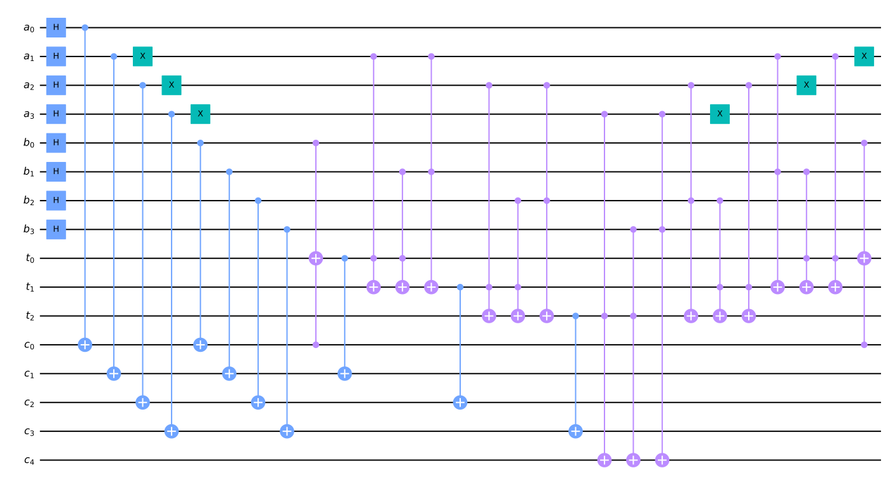
    


    # of performed simultaneously operations is 256


    /tmp/ipykernel_13937/3833806235.py:5: DeprecationWarning: The return type of saved statevectors has been changed from a `numpy.ndarray` to a `qiskit.quantum_info.Statevector` as of qiskit-aer 0.10. Accessing numpy array attributes is deprecated and will result in an error in a future release. To continue using saved result objects as arrays you can explicitly cast them using  `np.asarray(object)`.
      for i in range(len(sv)):


    [[0, 0.003906250000000007, '0000000000000000', '00000-000-0000-0000', '0=0-0'],
     [17,
      0.0039062500000000035,
      '0000000000010001',
      '00000-000-0001-0001',
      '0=1-1'],
     [34,
      0.0039062500000000035,
      '0000000000100010',
      '00000-000-0010-0010',
      '0=2-2'],
     [51, 0.00390625, '0000000000110011', '00000-000-0011-0011', '0=3-3'],
     [68,
      0.0039062500000000035,
      '0000000001000100',
      '00000-000-0100-0100',
      '0=4-4'],
     [85, 0.00390625, '0000000001010101', '00000-000-0101-0101', '0=5-5'],
     [102, 0.00390625, '0000000001100110', '00000-000-0110-0110', '0=6-6'],
     [119,
      0.0039062499999999965,
      '0000000001110111',
      '00000-000-0111-0111',
      '0=7-7'],
     [136,
      0.0039062500000000035,
      '0000000010001000',
      '00000-000-1000-1000',
      '0=8-8'],
     [153, 0.00390625, '0000000010011001', '00000-000-1001-1001', '0=9-9'],
     [170, 0.00390625, '0000000010101010', '00000-000-1010-1010', '0=10-10'],
     [187,
      0.0039062499999999965,
      '0000000010111011',
      '00000-000-1011-1011',
      '0=11-11'],
     [204, 0.00390625, '0000000011001100', '00000-000-1100-1100', '0=12-12'],
     [221,
      0.0039062499999999965,
      '0000000011011101',
      '00000-000-1101-1101',
      '0=13-13'],
     [238,
      0.0039062499999999965,
      '0000000011101110',
      '00000-000-1110-1110',
      '0=14-14'],
     [255,
      0.003906249999999993,
      '0000000011111111',
      '00000-000-1111-1111',
      '0=15-15'],
     [2049,
      0.003906250000000005,
      '0000100000000001',
      '00001-000-0000-0001',
      '1=1-0'],
     [2066,
      0.0039062500000000035,
      '0000100000010010',
      '00001-000-0001-0010',
      '1=2-1'],
     [2083,
      0.003906250000000002,
      '0000100000100011',
      '00001-000-0010-0011',
      '1=3-2'],
     [2100,
      0.003906250000000002,
      '0000100000110100',
      '00001-000-0011-0100',
      '1=4-3'],
     [2117,
      0.003906250000000002,
      '0000100001000101',
      '00001-000-0100-0101',
      '1=5-4'],
     [2134, 0.00390625, '0000100001010110', '00001-000-0101-0110', '1=6-5'],
     [2151,
      0.0039062499999999983,
      '0000100001100111',
      '00001-000-0110-0111',
      '1=7-6'],
     [2168, 0.00390625, '0000100001111000', '00001-000-0111-1000', '1=8-7'],
     [2185,
      0.003906250000000002,
      '0000100010001001',
      '00001-000-1000-1001',
      '1=9-8'],
     [2202, 0.00390625, '0000100010011010', '00001-000-1001-1010', '1=10-9'],
     [2219,
      0.0039062499999999983,
      '0000100010101011',
      '00001-000-1010-1011',
      '1=11-10'],
     [2236,
      0.0039062499999999983,
      '0000100010111100',
      '00001-000-1011-1100',
      '1=12-11'],
     [2253,
      0.0039062499999999983,
      '0000100011001101',
      '00001-000-1100-1101',
      '1=13-12'],
     [2270,
      0.0039062499999999965,
      '0000100011011110',
      '00001-000-1101-1110',
      '1=14-13'],
     [2287,
      0.003906249999999995,
      '0000100011101111',
      '00001-000-1110-1111',
      '1=15-14'],
     [4098,
      0.003906250000000005,
      '0001000000000010',
      '00010-000-0000-0010',
      '2=2-0'],
     [4115,
      0.003906250000000002,
      '0001000000010011',
      '00010-000-0001-0011',
      '2=3-1'],
     [4132,
      0.0039062500000000035,
      '0001000000100100',
      '00010-000-0010-0100',
      '2=4-2'],
     [4149, 0.00390625, '0001000000110101', '00010-000-0011-0101', '2=5-3'],
     [4166,
      0.003906250000000002,
      '0001000001000110',
      '00010-000-0100-0110',
      '2=6-4'],
     [4183,
      0.0039062499999999983,
      '0001000001010111',
      '00010-000-0101-0111',
      '2=7-5'],
     [4200,
      0.003906250000000002,
      '0001000001101000',
      '00010-000-0110-1000',
      '2=8-6'],
     [4217,
      0.0039062499999999983,
      '0001000001111001',
      '00010-000-0111-1001',
      '2=9-7'],
     [4234,
      0.003906250000000002,
      '0001000010001010',
      '00010-000-1000-1010',
      '2=10-8'],
     [4251,
      0.0039062499999999983,
      '0001000010011011',
      '00010-000-1001-1011',
      '2=11-9'],
     [4268, 0.00390625, '0001000010101100', '00010-000-1010-1100', '2=12-10'],
     [4285,
      0.0039062499999999965,
      '0001000010111101',
      '00010-000-1011-1101',
      '2=13-11'],
     [4302,
      0.0039062499999999983,
      '0001000011001110',
      '00010-000-1100-1110',
      '2=14-12'],
     [4319,
      0.003906249999999995,
      '0001000011011111',
      '00010-000-1101-1111',
      '2=15-13'],
     [6147,
      0.0039062500000000035,
      '0001100000000011',
      '00011-000-0000-0011',
      '3=3-0'],
     [6164,
      0.0039062500000000035,
      '0001100000010100',
      '00011-000-0001-0100',
      '3=4-1'],
     [6181,
      0.003906250000000002,
      '0001100000100101',
      '00011-000-0010-0101',
      '3=5-2'],
     [6198, 0.00390625, '0001100000110110', '00011-000-0011-0110', '3=6-3'],
     [6215, 0.00390625, '0001100001000111', '00011-000-0100-0111', '3=7-4'],
     [6232,
      0.003906250000000002,
      '0001100001011000',
      '00011-000-0101-1000',
      '3=8-5'],
     [6249, 0.00390625, '0001100001101001', '00011-000-0110-1001', '3=9-6'],
     [6266,
      0.0039062499999999983,
      '0001100001111010',
      '00011-000-0111-1010',
      '3=10-7'],
     [6283, 0.00390625, '0001100010001011', '00011-000-1000-1011', '3=11-8'],
     [6300, 0.00390625, '0001100010011100', '00011-000-1001-1100', '3=12-9'],
     [6317,
      0.0039062499999999983,
      '0001100010101101',
      '00011-000-1010-1101',
      '3=13-10'],
     [6334,
      0.0039062499999999965,
      '0001100010111110',
      '00011-000-1011-1110',
      '3=14-11'],
     [6351,
      0.0039062499999999965,
      '0001100011001111',
      '00011-000-1100-1111',
      '3=15-12'],
     [8196,
      0.003906250000000005,
      '0010000000000100',
      '00100-000-0000-0100',
      '4=4-0'],
     [8213,
      0.003906250000000002,
      '0010000000010101',
      '00100-000-0001-0101',
      '4=5-1'],
     [8230,
      0.003906250000000002,
      '0010000000100110',
      '00100-000-0010-0110',
      '4=6-2'],
     [8247,
      0.0039062499999999983,
      '0010000000110111',
      '00100-000-0011-0111',
      '4=7-3'],
     [8264,
      0.0039062500000000035,
      '0010000001001000',
      '00100-000-0100-1000',
      '4=8-4'],
     [8281, 0.00390625, '0010000001011001', '00100-000-0101-1001', '4=9-5'],
     [8298, 0.00390625, '0010000001101010', '00100-000-0110-1010', '4=10-6'],
     [8315,
      0.0039062499999999965,
      '0010000001111011',
      '00100-000-0111-1011',
      '4=11-7'],
     [8332,
      0.003906250000000002,
      '0010000010001100',
      '00100-000-1000-1100',
      '4=12-8'],
     [8349,
      0.0039062499999999983,
      '0010000010011101',
      '00100-000-1001-1101',
      '4=13-9'],
     [8366,
      0.0039062499999999983,
      '0010000010101110',
      '00100-000-1010-1110',
      '4=14-10'],
     [8383,
      0.003906249999999995,
      '0010000010111111',
      '00100-000-1011-1111',
      '4=15-11'],
     [10245,
      0.0039062500000000035,
      '0010100000000101',
      '00101-000-0000-0101',
      '5=5-0'],
     [10262,
      0.003906250000000002,
      '0010100000010110',
      '00101-000-0001-0110',
      '5=6-1'],
     [10279, 0.00390625, '0010100000100111', '00101-000-0010-0111', '5=7-2'],
     [10296,
      0.003906250000000002,
      '0010100000111000',
      '00101-000-0011-1000',
      '5=8-3'],
     [10313,
      0.003906250000000002,
      '0010100001001001',
      '00101-000-0100-1001',
      '5=9-4'],
     [10330, 0.00390625, '0010100001011010', '00101-000-0101-1010', '5=10-5'],
     [10347,
      0.0039062499999999983,
      '0010100001101011',
      '00101-000-0110-1011',
      '5=11-6'],
     [10364,
      0.0039062499999999983,
      '0010100001111100',
      '00101-000-0111-1100',
      '5=12-7'],
     [10381, 0.00390625, '0010100010001101', '00101-000-1000-1101', '5=13-8'],
     [10398,
      0.0039062499999999983,
      '0010100010011110',
      '00101-000-1001-1110',
      '5=14-9'],
     [10415,
      0.0039062499999999965,
      '0010100010101111',
      '00101-000-1010-1111',
      '5=15-10'],
     [12294,
      0.0039062500000000035,
      '0011000000000110',
      '00110-000-0000-0110',
      '6=6-0'],
     [12311, 0.00390625, '0011000000010111', '00110-000-0001-0111', '6=7-1'],
     [12328,
      0.0039062500000000035,
      '0011000000101000',
      '00110-000-0010-1000',
      '6=8-2'],
     [12345, 0.00390625, '0011000000111001', '00110-000-0011-1001', '6=9-3'],
     [12362,
      0.003906250000000002,
      '0011000001001010',
      '00110-000-0100-1010',
      '6=10-4'],
     [12379,
      0.0039062499999999983,
      '0011000001011011',
      '00110-000-0101-1011',
      '6=11-5'],
     [12396, 0.00390625, '0011000001101100', '00110-000-0110-1100', '6=12-6'],
     [12413,
      0.0039062499999999965,
      '0011000001111101',
      '00110-000-0111-1101',
      '6=13-7'],
     [12430, 0.00390625, '0011000010001110', '00110-000-1000-1110', '6=14-8'],
     [12447,
      0.0039062499999999965,
      '0011000010011111',
      '00110-000-1001-1111',
      '6=15-9'],
     [14343,
      0.003906250000000002,
      '0011100000000111',
      '00111-000-0000-0111',
      '7=7-0'],
     [14360,
      0.0039062500000000035,
      '0011100000011000',
      '00111-000-0001-1000',
      '7=8-1'],
     [14377,
      0.003906250000000002,
      '0011100000101001',
      '00111-000-0010-1001',
      '7=9-2'],
     [14394, 0.00390625, '0011100000111010', '00111-000-0011-1010', '7=10-3'],
     [14411, 0.00390625, '0011100001001011', '00111-000-0100-1011', '7=11-4'],
     [14428, 0.00390625, '0011100001011100', '00111-000-0101-1100', '7=12-5'],
     [14445,
      0.0039062499999999983,
      '0011100001101101',
      '00111-000-0110-1101',
      '7=13-6'],
     [14462,
      0.0039062499999999965,
      '0011100001111110',
      '00111-000-0111-1110',
      '7=14-7'],
     [14479,
      0.0039062499999999983,
      '0011100010001111',
      '00111-000-1000-1111',
      '7=15-8'],
     [16392,
      0.003906250000000005,
      '0100000000001000',
      '01000-000-0000-1000',
      '8=8-0'],
     [16409,
      0.003906250000000002,
      '0100000000011001',
      '01000-000-0001-1001',
      '8=9-1'],
     [16426,
      0.003906250000000002,
      '0100000000101010',
      '01000-000-0010-1010',
      '8=10-2'],
     [16443,
      0.0039062499999999983,
      '0100000000111011',
      '01000-000-0011-1011',
      '8=11-3'],
     [16460,
      0.003906250000000002,
      '0100000001001100',
      '01000-000-0100-1100',
      '8=12-4'],
     [16477,
      0.0039062499999999983,
      '0100000001011101',
      '01000-000-0101-1101',
      '8=13-5'],
     [16494,
      0.0039062499999999983,
      '0100000001101110',
      '01000-000-0110-1110',
      '8=14-6'],
     [16511,
      0.003906249999999995,
      '0100000001111111',
      '01000-000-0111-1111',
      '8=15-7'],
     [18441,
      0.0039062500000000035,
      '0100100000001001',
      '01001-000-0000-1001',
      '9=9-0'],
     [18458,
      0.003906250000000002,
      '0100100000011010',
      '01001-000-0001-1010',
      '9=10-1'],
     [18475, 0.00390625, '0100100000101011', '01001-000-0010-1011', '9=11-2'],
     [18492, 0.00390625, '0100100000111100', '01001-000-0011-1100', '9=12-3'],
     [18509, 0.00390625, '0100100001001101', '01001-000-0100-1101', '9=13-4'],
     [18526,
      0.0039062499999999983,
      '0100100001011110',
      '01001-000-0101-1110',
      '9=14-5'],
     [18543,
      0.0039062499999999965,
      '0100100001101111',
      '01001-000-0110-1111',
      '9=15-6'],
     [20490,
      0.0039062500000000035,
      '0101000000001010',
      '01010-000-0000-1010',
      '10=10-0'],
     [20507, 0.00390625, '0101000000011011', '01010-000-0001-1011', '10=11-1'],
     [20524,
      0.003906250000000002,
      '0101000000101100',
      '01010-000-0010-1100',
      '10=12-2'],
     [20541,
      0.0039062499999999983,
      '0101000000111101',
      '01010-000-0011-1101',
      '10=13-3'],
     [20558, 0.00390625, '0101000001001110', '01010-000-0100-1110', '10=14-4'],
     [20575,
      0.0039062499999999965,
      '0101000001011111',
      '01010-000-0101-1111',
      '10=15-5'],
     [22539,
      0.003906250000000002,
      '0101100000001011',
      '01011-000-0000-1011',
      '11=11-0'],
     [22556,
      0.003906250000000002,
      '0101100000011100',
      '01011-000-0001-1100',
      '11=12-1'],
     [22573, 0.00390625, '0101100000101101', '01011-000-0010-1101', '11=13-2'],
     [22590,
      0.0039062499999999983,
      '0101100000111110',
      '01011-000-0011-1110',
      '11=14-3'],
     [22607,
      0.0039062499999999983,
      '0101100001001111',
      '01011-000-0100-1111',
      '11=15-4'],
     [24588,
      0.0039062500000000035,
      '0110000000001100',
      '01100-000-0000-1100',
      '12=12-0'],
     [24605, 0.00390625, '0110000000011101', '01100-000-0001-1101', '12=13-1'],
     [24622, 0.00390625, '0110000000101110', '01100-000-0010-1110', '12=14-2'],
     [24639,
      0.0039062499999999965,
      '0110000000111111',
      '01100-000-0011-1111',
      '12=15-3'],
     [26637,
      0.003906250000000002,
      '0110100000001101',
      '01101-000-0000-1101',
      '13=13-0'],
     [26654, 0.00390625, '0110100000011110', '01101-000-0001-1110', '13=14-1'],
     [26671,
      0.0039062499999999983,
      '0110100000101111',
      '01101-000-0010-1111',
      '13=15-2'],
     [28686,
      0.003906250000000002,
      '0111000000001110',
      '01110-000-0000-1110',
      '14=14-0'],
     [28703,
      0.0039062499999999983,
      '0111000000011111',
      '01110-000-0001-1111',
      '14=15-1'],
     [30735, 0.00390625, '0111100000001111', '01111-000-0000-1111', '15=15-0'],
     [35056, 0.00390625, '1000100011110000', '10001-000-1111-0000', '-15=0-15'],
     [37088,
      0.003906250000000002,
      '1001000011100000',
      '10010-000-1110-0000',
      '-14=0-14'],
     [37105,
      0.0039062499999999983,
      '1001000011110001',
      '10010-000-1111-0001',
      '-14=1-15'],
     [39120,
      0.003906250000000002,
      '1001100011010000',
      '10011-000-1101-0000',
      '-13=0-13'],
     [39137, 0.00390625, '1001100011100001', '10011-000-1110-0001', '-13=1-14'],
     [39154,
      0.0039062499999999983,
      '1001100011110010',
      '10011-000-1111-0010',
      '-13=2-15'],
     [41152,
      0.0039062500000000035,
      '1010000011000000',
      '10100-000-1100-0000',
      '-12=0-12'],
     [41169, 0.00390625, '1010000011010001', '10100-000-1101-0001', '-12=1-13'],
     [41186, 0.00390625, '1010000011100010', '10100-000-1110-0010', '-12=2-14'],
     [41203,
      0.0039062499999999965,
      '1010000011110011',
      '10100-000-1111-0011',
      '-12=3-15'],
     [43184,
      0.003906250000000002,
      '1010100010110000',
      '10101-000-1011-0000',
      '-11=0-11'],
     [43201,
      0.003906250000000002,
      '1010100011000001',
      '10101-000-1100-0001',
      '-11=1-12'],
     [43218, 0.00390625, '1010100011010010', '10101-000-1101-0010', '-11=2-13'],
     [43235,
      0.0039062499999999983,
      '1010100011100011',
      '10101-000-1110-0011',
      '-11=3-14'],
     [43252,
      0.0039062499999999983,
      '1010100011110100',
      '10101-000-1111-0100',
      '-11=4-15'],
     [45216,
      0.0039062500000000035,
      '1011000010100000',
      '10110-000-1010-0000',
      '-10=0-10'],
     [45233, 0.00390625, '1011000010110001', '10110-000-1011-0001', '-10=1-11'],
     [45250,
      0.003906250000000002,
      '1011000011000010',
      '10110-000-1100-0010',
      '-10=2-12'],
     [45267,
      0.0039062499999999983,
      '1011000011010011',
      '10110-000-1101-0011',
      '-10=3-13'],
     [45284, 0.00390625, '1011000011100100', '10110-000-1110-0100', '-10=4-14'],
     [45301,
      0.0039062499999999965,
      '1011000011110101',
      '10110-000-1111-0101',
      '-10=5-15'],
     [47248,
      0.0039062500000000035,
      '1011100010010000',
      '10111-000-1001-0000',
      '-9=0-9'],
     [47265,
      0.003906250000000002,
      '1011100010100001',
      '10111-000-1010-0001',
      '-9=1-10'],
     [47282, 0.00390625, '1011100010110010', '10111-000-1011-0010', '-9=2-11'],
     [47299, 0.00390625, '1011100011000011', '10111-000-1100-0011', '-9=3-12'],
     [47316, 0.00390625, '1011100011010100', '10111-000-1101-0100', '-9=4-13'],
     [47333,
      0.0039062499999999983,
      '1011100011100101',
      '10111-000-1110-0101',
      '-9=5-14'],
     [47350,
      0.0039062499999999965,
      '1011100011110110',
      '10111-000-1111-0110',
      '-9=6-15'],
     [49280,
      0.003906250000000005,
      '1100000010000000',
      '11000-000-1000-0000',
      '-8=0-8'],
     [49297,
      0.003906250000000002,
      '1100000010010001',
      '11000-000-1001-0001',
      '-8=1-9'],
     [49314,
      0.003906250000000002,
      '1100000010100010',
      '11000-000-1010-0010',
      '-8=2-10'],
     [49331,
      0.0039062499999999983,
      '1100000010110011',
      '11000-000-1011-0011',
      '-8=3-11'],
     [49348,
      0.003906250000000002,
      '1100000011000100',
      '11000-000-1100-0100',
      '-8=4-12'],
     [49365,
      0.0039062499999999983,
      '1100000011010101',
      '11000-000-1101-0101',
      '-8=5-13'],
     [49382,
      0.0039062499999999983,
      '1100000011100110',
      '11000-000-1110-0110',
      '-8=6-14'],
     [49399,
      0.003906249999999995,
      '1100000011110111',
      '11000-000-1111-0111',
      '-8=7-15'],
     [51312,
      0.003906250000000002,
      '1100100001110000',
      '11001-000-0111-0000',
      '-7=0-7'],
     [51329,
      0.0039062500000000035,
      '1100100010000001',
      '11001-000-1000-0001',
      '-7=1-8'],
     [51346,
      0.003906250000000002,
      '1100100010010010',
      '11001-000-1001-0010',
      '-7=2-9'],
     [51363, 0.00390625, '1100100010100011', '11001-000-1010-0011', '-7=3-10'],
     [51380, 0.00390625, '1100100010110100', '11001-000-1011-0100', '-7=4-11'],
     [51397, 0.00390625, '1100100011000101', '11001-000-1100-0101', '-7=5-12'],
     [51414,
      0.0039062499999999983,
      '1100100011010110',
      '11001-000-1101-0110',
      '-7=6-13'],
     [51431,
      0.0039062499999999965,
      '1100100011100111',
      '11001-000-1110-0111',
      '-7=7-14'],
     [51448,
      0.0039062499999999983,
      '1100100011111000',
      '11001-000-1111-1000',
      '-7=8-15'],
     [53344,
      0.0039062500000000035,
      '1101000001100000',
      '11010-000-0110-0000',
      '-6=0-6'],
     [53361, 0.00390625, '1101000001110001', '11010-000-0111-0001', '-6=1-7'],
     [53378,
      0.0039062500000000035,
      '1101000010000010',
      '11010-000-1000-0010',
      '-6=2-8'],
     [53395, 0.00390625, '1101000010010011', '11010-000-1001-0011', '-6=3-9'],
     [53412,
      0.003906250000000002,
      '1101000010100100',
      '11010-000-1010-0100',
      '-6=4-10'],
     [53429,
      0.0039062499999999983,
      '1101000010110101',
      '11010-000-1011-0101',
      '-6=5-11'],
     [53446, 0.00390625, '1101000011000110', '11010-000-1100-0110', '-6=6-12'],
     [53463,
      0.0039062499999999965,
      '1101000011010111',
      '11010-000-1101-0111',
      '-6=7-13'],
     [53480, 0.00390625, '1101000011101000', '11010-000-1110-1000', '-6=8-14'],
     [53497,
      0.0039062499999999965,
      '1101000011111001',
      '11010-000-1111-1001',
      '-6=9-15'],
     [55376,
      0.0039062500000000035,
      '1101100001010000',
      '11011-000-0101-0000',
      '-5=0-5'],
     [55393,
      0.003906250000000002,
      '1101100001100001',
      '11011-000-0110-0001',
      '-5=1-6'],
     [55410, 0.00390625, '1101100001110010', '11011-000-0111-0010', '-5=2-7'],
     [55427,
      0.003906250000000002,
      '1101100010000011',
      '11011-000-1000-0011',
      '-5=3-8'],
     [55444,
      0.003906250000000002,
      '1101100010010100',
      '11011-000-1001-0100',
      '-5=4-9'],
     [55461, 0.00390625, '1101100010100101', '11011-000-1010-0101', '-5=5-10'],
     [55478,
      0.0039062499999999983,
      '1101100010110110',
      '11011-000-1011-0110',
      '-5=6-11'],
     [55495,
      0.0039062499999999983,
      '1101100011000111',
      '11011-000-1100-0111',
      '-5=7-12'],
     [55512, 0.00390625, '1101100011011000', '11011-000-1101-1000', '-5=8-13'],
     [55529,
      0.0039062499999999983,
      '1101100011101001',
      '11011-000-1110-1001',
      '-5=9-14'],
     [55546,
      0.0039062499999999965,
      '1101100011111010',
      '11011-000-1111-1010',
      '-5=10-15'],
     [57408,
      0.003906250000000005,
      '1110000001000000',
      '11100-000-0100-0000',
      '-4=0-4'],
     [57425,
      0.003906250000000002,
      '1110000001010001',
      '11100-000-0101-0001',
      '-4=1-5'],
     [57442,
      0.003906250000000002,
      '1110000001100010',
      '11100-000-0110-0010',
      '-4=2-6'],
     [57459,
      0.0039062499999999983,
      '1110000001110011',
      '11100-000-0111-0011',
      '-4=3-7'],
     [57476,
      0.0039062500000000035,
      '1110000010000100',
      '11100-000-1000-0100',
      '-4=4-8'],
     [57493, 0.00390625, '1110000010010101', '11100-000-1001-0101', '-4=5-9'],
     [57510, 0.00390625, '1110000010100110', '11100-000-1010-0110', '-4=6-10'],
     [57527,
      0.0039062499999999965,
      '1110000010110111',
      '11100-000-1011-0111',
      '-4=7-11'],
     [57544,
      0.003906250000000002,
      '1110000011001000',
      '11100-000-1100-1000',
      '-4=8-12'],
     [57561,
      0.0039062499999999983,
      '1110000011011001',
      '11100-000-1101-1001',
      '-4=9-13'],
     [57578,
      0.0039062499999999983,
      '1110000011101010',
      '11100-000-1110-1010',
      '-4=10-14'],
     [57595,
      0.003906249999999995,
      '1110000011111011',
      '11100-000-1111-1011',
      '-4=11-15'],
     [59440,
      0.0039062500000000035,
      '1110100000110000',
      '11101-000-0011-0000',
      '-3=0-3'],
     [59457,
      0.0039062500000000035,
      '1110100001000001',
      '11101-000-0100-0001',
      '-3=1-4'],
     [59474,
      0.003906250000000002,
      '1110100001010010',
      '11101-000-0101-0010',
      '-3=2-5'],
     [59491, 0.00390625, '1110100001100011', '11101-000-0110-0011', '-3=3-6'],
     [59508, 0.00390625, '1110100001110100', '11101-000-0111-0100', '-3=4-7'],
     [59525,
      0.003906250000000002,
      '1110100010000101',
      '11101-000-1000-0101',
      '-3=5-8'],
     [59542, 0.00390625, '1110100010010110', '11101-000-1001-0110', '-3=6-9'],
     [59559,
      0.0039062499999999983,
      '1110100010100111',
      '11101-000-1010-0111',
      '-3=7-10'],
     [59576, 0.00390625, '1110100010111000', '11101-000-1011-1000', '-3=8-11'],
     [59593, 0.00390625, '1110100011001001', '11101-000-1100-1001', '-3=9-12'],
     [59610,
      0.0039062499999999983,
      '1110100011011010',
      '11101-000-1101-1010',
      '-3=10-13'],
     [59627,
      0.0039062499999999965,
      '1110100011101011',
      '11101-000-1110-1011',
      '-3=11-14'],
     [59644,
      0.0039062499999999965,
      '1110100011111100',
      '11101-000-1111-1100',
      '-3=12-15'],
     [61472,
      0.003906250000000005,
      '1111000000100000',
      '11110-000-0010-0000',
      '-2=0-2'],
     [61489,
      0.003906250000000002,
      '1111000000110001',
      '11110-000-0011-0001',
      '-2=1-3'],
     [61506,
      0.0039062500000000035,
      '1111000001000010',
      '11110-000-0100-0010',
      '-2=2-4'],
     [61523, 0.00390625, '1111000001010011', '11110-000-0101-0011', '-2=3-5'],
     [61540,
      0.003906250000000002,
      '1111000001100100',
      '11110-000-0110-0100',
      '-2=4-6'],
     [61557,
      0.0039062499999999983,
      '1111000001110101',
      '11110-000-0111-0101',
      '-2=5-7'],
     [61574,
      0.003906250000000002,
      '1111000010000110',
      '11110-000-1000-0110',
      '-2=6-8'],
     [61591,
      0.0039062499999999983,
      '1111000010010111',
      '11110-000-1001-0111',
      '-2=7-9'],
     [61608,
      0.003906250000000002,
      '1111000010101000',
      '11110-000-1010-1000',
      '-2=8-10'],
     [61625,
      0.0039062499999999983,
      '1111000010111001',
      '11110-000-1011-1001',
      '-2=9-11'],
     [61642, 0.00390625, '1111000011001010', '11110-000-1100-1010', '-2=10-12'],
     [61659,
      0.0039062499999999965,
      '1111000011011011',
      '11110-000-1101-1011',
      '-2=11-13'],
     [61676,
      0.0039062499999999983,
      '1111000011101100',
      '11110-000-1110-1100',
      '-2=12-14'],
     [61693,
      0.003906249999999995,
      '1111000011111101',
      '11110-000-1111-1101',
      '-2=13-15'],
     [63504,
      0.003906250000000005,
      '1111100000010000',
      '11111-000-0001-0000',
      '-1=0-1'],
     [63521,
      0.0039062500000000035,
      '1111100000100001',
      '11111-000-0010-0001',
      '-1=1-2'],
     [63538,
      0.003906250000000002,
      '1111100000110010',
      '11111-000-0011-0010',
      '-1=2-3'],
     [63555,
      0.003906250000000002,
      '1111100001000011',
      '11111-000-0100-0011',
      '-1=3-4'],
     [63572,
      0.003906250000000002,
      '1111100001010100',
      '11111-000-0101-0100',
      '-1=4-5'],
     [63589, 0.00390625, '1111100001100101', '11111-000-0110-0101', '-1=5-6'],
     [63606,
      0.0039062499999999983,
      '1111100001110110',
      '11111-000-0111-0110',
      '-1=6-7'],
     [63623, 0.00390625, '1111100010000111', '11111-000-1000-0111', '-1=7-8'],
     [63640,
      0.003906250000000002,
      '1111100010011000',
      '11111-000-1001-1000',
      '-1=8-9'],
     [63657, 0.00390625, '1111100010101001', '11111-000-1010-1001', '-1=9-10'],
     [63674,
      0.0039062499999999983,
      '1111100010111010',
      '11111-000-1011-1010',
      '-1=10-11'],
     [63691,
      0.0039062499999999983,
      '1111100011001011',
      '11111-000-1100-1011',
      '-1=11-12'],
     [63708,
      0.0039062499999999983,
      '1111100011011100',
      '11111-000-1101-1100',
      '-1=12-13'],
     [63725,
      0.0039062499999999965,
      '1111100011101101',
      '11111-000-1110-1101',
      '-1=13-14'],
     [63742,
      0.003906249999999995,
      '1111100011111110',
      '11111-000-1111-1110',
      '-1=14-15']]


### Current Status of QALU
QALU is now well-optimized and deployed on open source. 

You can download it from [QALU](https://github.com/QArchs/QALU)
