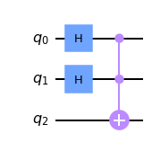
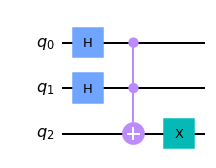
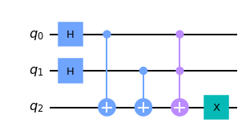
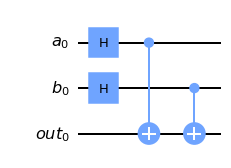
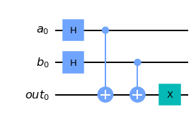
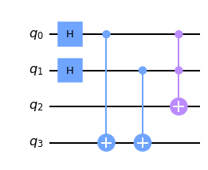
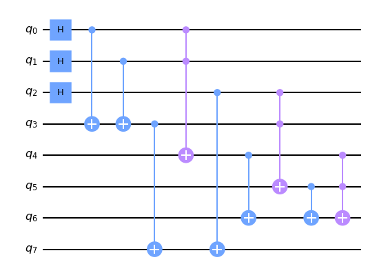
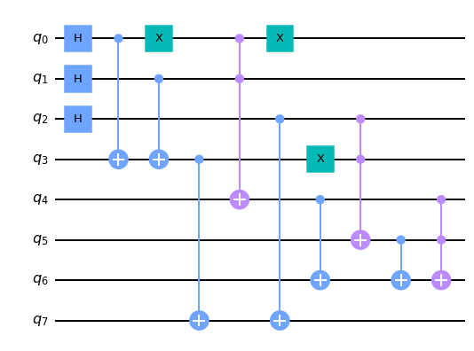

# QALU
Quantum Arithmetic Logic Unit

<a href="qalu.py">Download QALU </a>

For further documentation, see <a href="QALU.ipynb">here</a>
|Function|Schema|Superposed State|
|--|-|--|
|and_()|||
|nand_()|||
|or_()|||
|nor_()|||
|xor_()|||
|xnor_()|||
|half_adder()|||
|full_adder()|||
|half_subtractor()|||
|full_subtractor()|||
