# QALU
Quantum Arithmetic Logic Unit

    pip install QALU
    
For Docs, <a href="https://github.com/alihakimtaskiran/QALU/blob/main/Docs/README.MD">cilck here</a>
|Function|Schema|Superposed State|
|--|-|--|
|**and_**(circ,a,b,out)|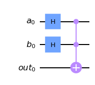|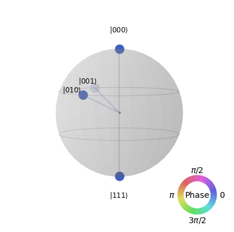|
|**nand_**(circ,a,b,out)|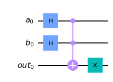|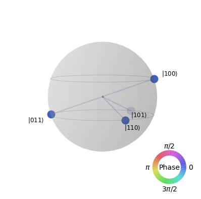|
|**or_**(circ,a,b,out)|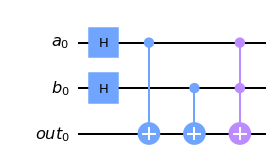|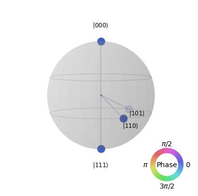|
|**nor_**(circ,a,b,out)|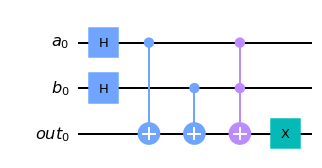|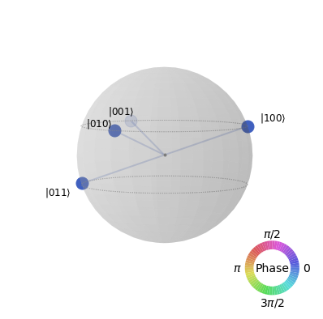|
|**xor**_(circ,a,b,out)|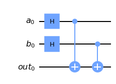|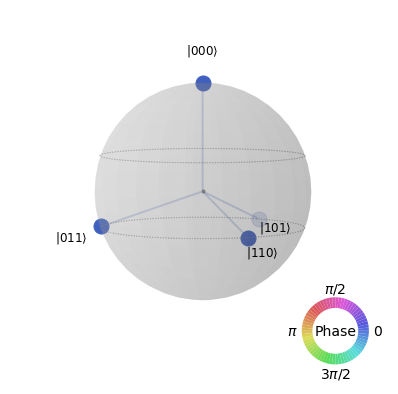|
|**xnor**_(circ,a,b,out)|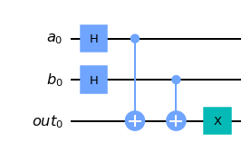|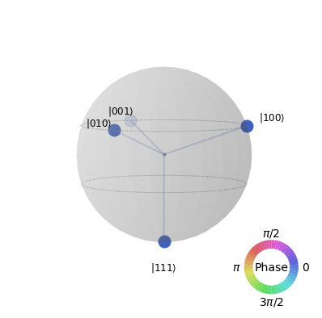|
|**half_adder**(circ, a, b, carry,sum_)|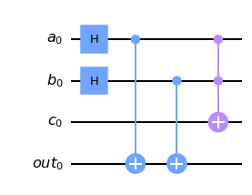|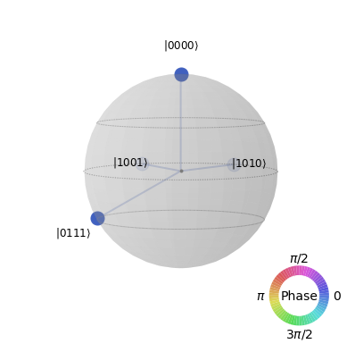|
|**full_adder**(circ,a,b,c_in,c_out,sum_)|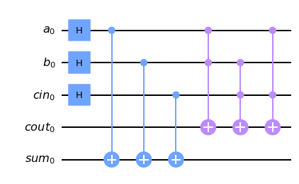|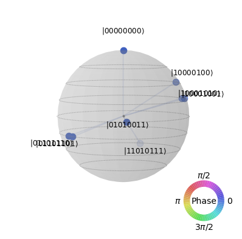|
|**half_subtractor**(circ, a, b, bor, diff)|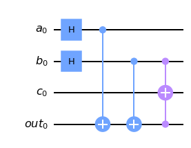|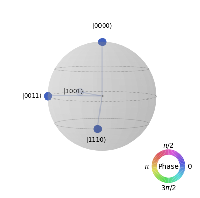|
|**full_subtractor**(circ,a,b,b_in,b_out,diff)|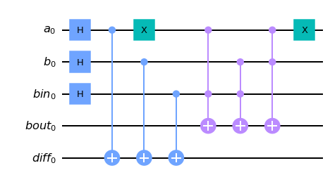|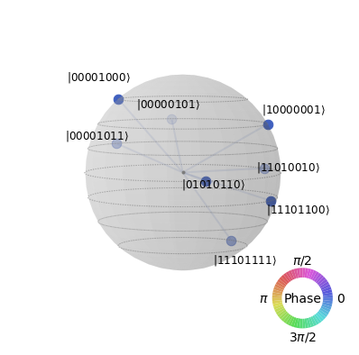|
|**multi_qubits_adder**(circ,A,B,T,C)|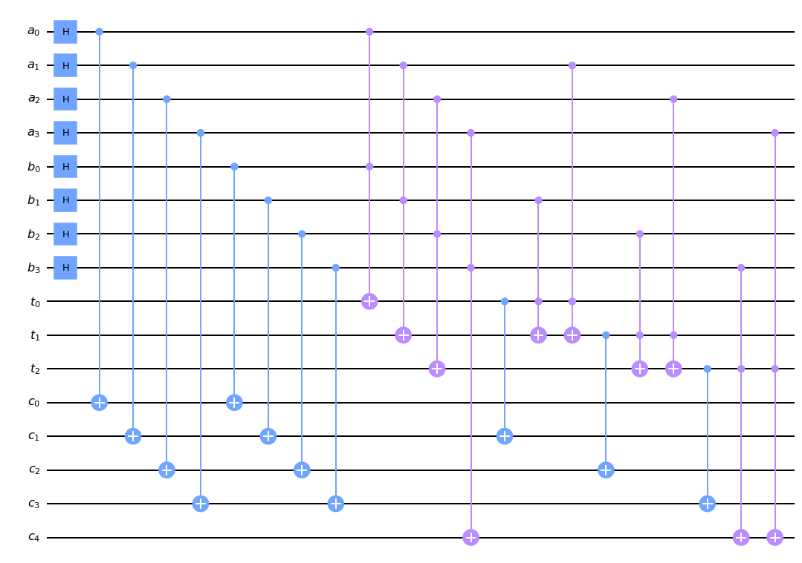|No state sphere provided|
|**multi_qubits_subtractor**(circ,A,B,T,C)|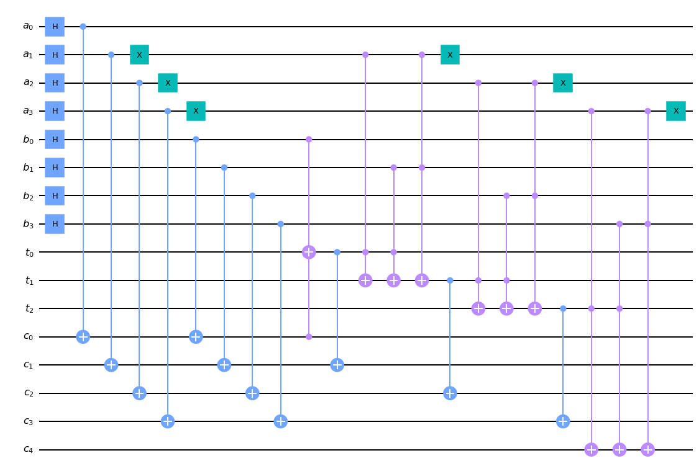|No state sphere provided|
